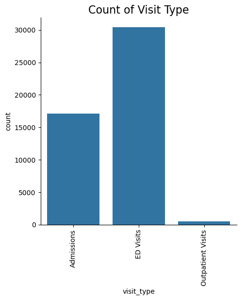
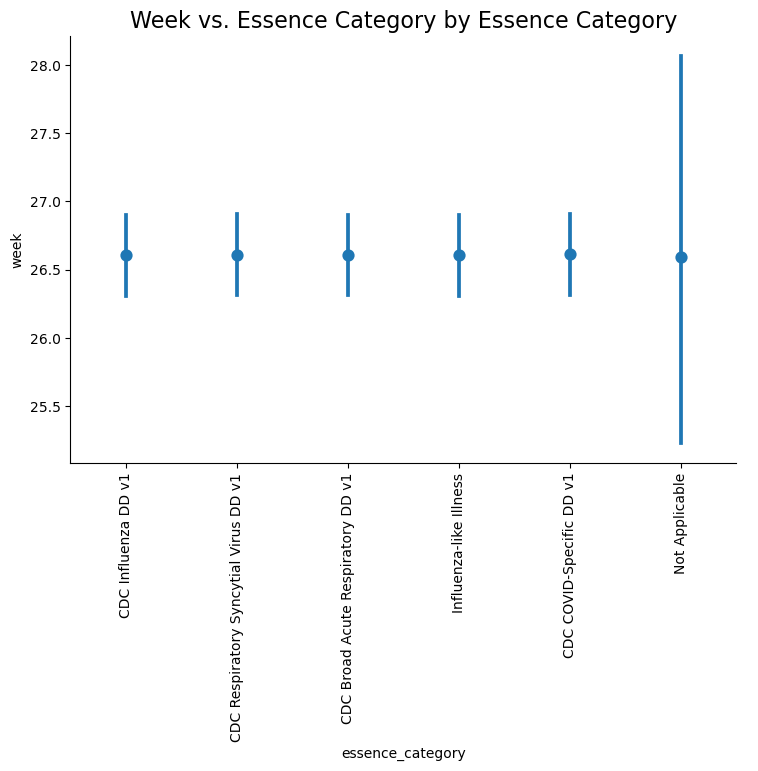
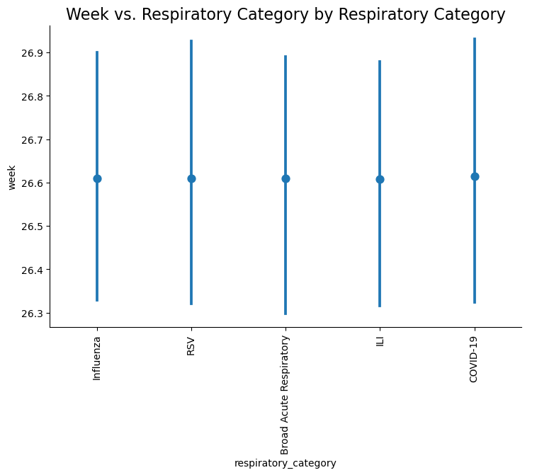
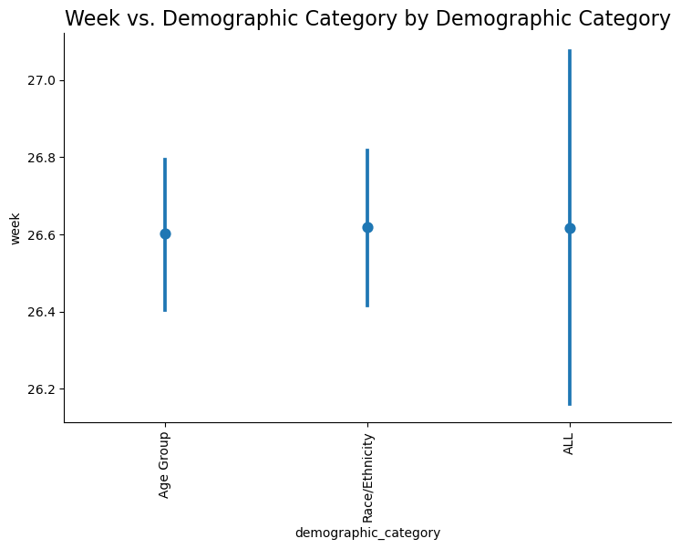
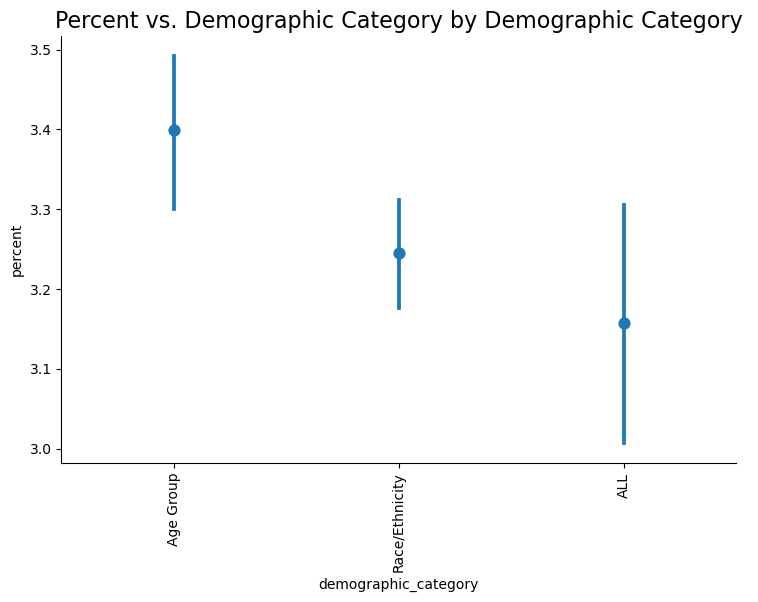
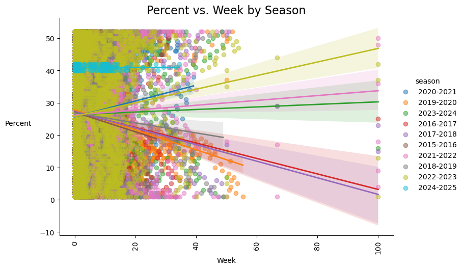
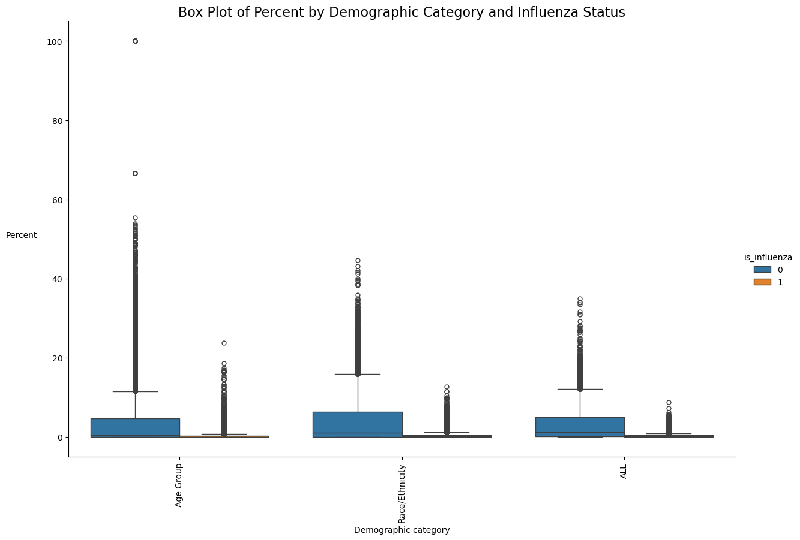
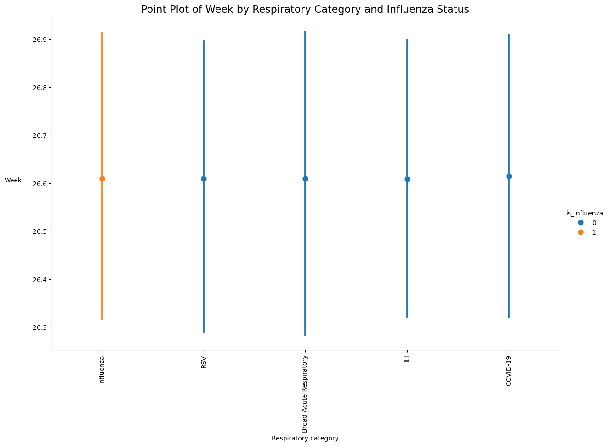
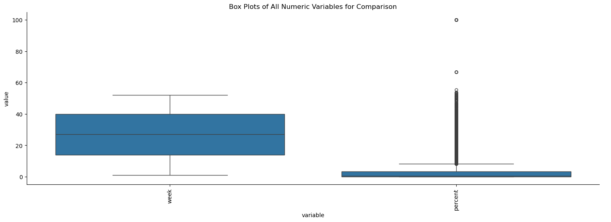
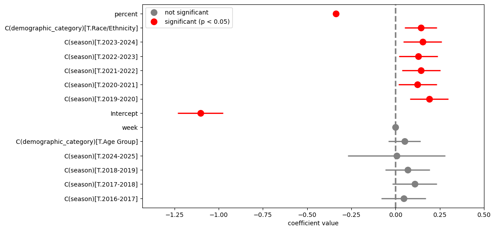

# Chicago Influenza Binary Classification

### [dataset](https://catalog.data.gov/dataset/inpatient-emergency-department-and-outpatient-visits-for-respiratory-illnesses)

Author: [Kevin Thomas](mailto:ket189@pitt.edu)

License: No license information was provided.

## **Executive Summary**

### **Objective**

This report presents the development and evaluation of a binary classification model designed to predict influenza cases (`is_influenza`) within Chicago’s healthcare data. Utilizing a comprehensive dataset spanning clinical visits from 2015 to 2025, the model aims to enhance early detection and resource allocation for influenza management.

### **Data Insights**

**1. Continuous Variables Analysis**
- **Week Distribution:** Data exhibits a uniform distribution across weeks, ensuring temporal coverage.
- **Percent Variable:** Heavily skewed towards lower values, indicating most observations have low percentage metrics.
- **Class Imbalance:** The target variable `is_influenza` is significantly imbalanced, with non-influenza cases predominating. This imbalance poses challenges for accurate prediction, potentially biasing the model towards non-influenza outcomes.

**2. Categorical Variables Analysis**
- **Seasonal Representation:** Data is primarily concentrated between 2019 and 2024, with sparse entries for the 2024-2025 season.
- **Visit Types:** Emergency Department (ED) visits dominate, while outpatient visits are infrequent.
- **Respiratory Categories:** Influenza, RSV, and COVID-19 are well-represented, reflecting prevalent respiratory conditions.
- **Demographics:** Balanced distribution across key demographic groups, particularly among individuals aged 65+, and various racial/ethnic categories.

**3. Advanced Visualizations**
- **Dodged Bar Charts & Heatmaps:** Highlight consistent high counts of Influenza and RSV, with notable COVID-19 spikes during 2020-2023. ED visits remain the primary mode of healthcare engagement, especially among older populations during pandemic periods.
- **Box and Violin Plots:** Reveal increased variability in the `percent` variable during pandemic years, with significant outliers in younger (0-4) and older (65+) age groups.
- **Correlation Analysis:** Minimal correlations between week, percent, and `is_influenza` (with a weak positive correlation of 0.21 between percent and `is_influenza`), indicating limited linear relationships among these variables.
- **Trend Analysis:** Demonstrates upward trends in percentage metrics over weeks, particularly in recent seasons, and consistent increases in ED visits across demographics.

### **Model Development and Selection**

**Model Evaluation**
- **Model 96:** Exhibited overfitting, compromising its generalizability.
- **Model 99:** Encountered convergence issues, likely due to multicollinearity or excessive complexity.
- **Model 117:** Selected as the optimal model due to its balance between performance and simplicity. Key metrics include:
  - **Accuracy:** 80.21%
  - **ROC AUC:** 0.696
  - **Complexity:** 14 coefficients, reducing the risk of overfitting and enhancing stability during training.

### **Implications**

The selected Model 117 demonstrates robust performance with adequate accuracy and discriminative ability, making it suitable for deployment in predicting influenza cases. Its simplicity ensures better generalization to new data, essential for real-world applications in public health surveillance and response.

### **Recommendations and Next Steps**

1. **Address Class Imbalance:** Implement techniques such as resampling, synthetic data generation, or algorithmic adjustments to mitigate the impact of class imbalance and improve predictive performance for influenza cases.
2. **Feature Engineering:** Explore additional features or interactions that may enhance model performance, particularly focusing on demographic and temporal patterns.
3. **Model Validation:** Conduct further validation using external datasets to ensure the model's reliability and applicability across different populations and timeframes.
4. **Deployment and Monitoring:** Integrate the model into public health systems for real-time influenza prediction and continuously monitor its performance to facilitate timely interventions.

### **Conclusion**

The development of a stable and effective influenza prediction model, supported by thorough data analysis and careful model selection, provides a valuable tool for enhancing public health strategies in Chicago. By addressing existing data challenges and refining predictive capabilities, this model holds significant potential for improving influenza case management and resource allocation.

## Import Main Modules & Dataset


```python
import numpy as np
import pandas as pd
import matplotlib.pyplot as plt
import seaborn as sns
```


```python
import itertools
```


```python
import statsmodels.formula.api as smf
```


```python
df = pd.read_csv('Inpatient__Emergency_Department__and_Outpatient_Visits_for_Respiratory_Illnesses.csv')
```

## Perform Basic Analysis


```python
df.shape
```


    (48181, 13)


```python
df.dtypes
```


    mmwr_week                 int64
    week                      int64
    week_start               object
    week_end                 object
    season                   object
    data_source              object
    essence_category         object
    respiratory_category     object
    visit_type               object
    demographic_category     object
    demographic_group        object
    percent                 float64
    current_week_ending      object
    dtype: object


```python
_ = [print(f'{df[column].value_counts()}\n') for column in df.columns]
```

    mmwr_week
    202043    131
    202119    131
    202347    131
    202237    131
    202036    131
             ... 
    201838     66
    201816     66
    201630     66
    201725     66
    201936     66
    Name: count, Length: 471, dtype: int64
    
    week
    40    1050
    42    1050
    41    1050
    43     919
    52     919
    7      919
    1      919
    18     919
    50     919
    47     919
    20     919
    14     919
    10     919
    48     919
    25     919
    36     919
    9      919
    2      919
    28     919
    51     919
    38     919
    12     919
    15     919
    16     919
    3      919
    5      919
    4      919
    32     919
    34     919
    39     919
    6      919
    29     919
    49     919
    26     919
    24     919
    37     919
    30     919
    11     919
    8      919
    46     919
    35     919
    27     919
    44     919
    19     919
    23     919
    21     919
    13     919
    17     919
    45     919
    33     919
    22     919
    31     919
    Name: count, dtype: int64
    
    week_start
    10/18/2020    131
    05/09/2021    131
    11/19/2023    131
    09/11/2022    131
    08/30/2020    131
                 ... 
    09/16/2018     66
    04/15/2018     66
    07/24/2016     66
    06/18/2017     66
    09/01/2019     66
    Name: count, Length: 471, dtype: int64
    
    week_end
    10/24/2020    131
    05/15/2021    131
    11/25/2023    131
    09/17/2022    131
    09/05/2020    131
                 ... 
    09/22/2018     66
    04/21/2018     66
    07/30/2016     66
    06/24/2017     66
    09/07/2019     66
    Name: count, Length: 471, dtype: int64
    
    season
    2020-2021    6812
    2019-2020    6812
    2023-2024    6812
    2021-2022    6812
    2022-2023    6812
    2016-2017    3432
    2017-2018    3432
    2015-2016    3432
    2018-2019    3432
    2024-2025     393
    Name: count, dtype: int64
    
    data_source
    ESSENCE    47710
    ILINet       471
    Name: count, dtype: int64
    
    essence_category
    CDC Influenza DD v1                      9542
    CDC Respiratory Syncytial Virus DD v1    9542
    CDC Broad Acute Respiratory DD v1        9542
    Influenza-like Illness                   9542
    CDC COVID-Specific DD v1                 9542
    Not Applicable                            471
    Name: count, dtype: int64
    
    respiratory_category
    ILI                        10013
    Influenza                   9542
    RSV                         9542
    Broad Acute Respiratory     9542
    COVID-19                    9542
    Name: count, dtype: int64
    
    visit_type
    ED Visits            30615
    Admissions           17095
    Outpatient Visits      471
    Name: count, dtype: int64
    
    demographic_category
    Age Group         22020
    Race/Ethnicity    22020
    ALL                4141
    Name: count, dtype: int64
    
    demographic_group
    ALL                       4141
    65+                       3670
    Asian Non-Hispanic        3670
    45_64                     3670
    Age Unknown               3670
    Other Race/Ethnicity      3670
    Hispanic or Latino        3670
    Unknown Race/Ethnicity    3670
    18_44                     3670
    Black Non-Hispanic        3670
    White Non-Hispanic        3670
    05_17                     3670
    00_04                     3670
    Name: count, dtype: int64
    
    percent
    0.00     14089
    0.02       641
    0.05       537
    0.07       496
    0.03       476
             ...  
    28.46        1
    35.93        1
    21.96        1
    22.14        1
    34.50        1
    Name: count, Length: 2827, dtype: int64
    
    current_week_ending
    10/05/2024    1050
    10/19/2024    1050
    10/12/2024    1050
    10/26/2024     919
    12/28/2024     919
    02/15/2025     919
    01/04/2025     919
    05/03/2025     919
    12/14/2024     919
    11/23/2024     919
    05/17/2025     919
    04/05/2025     919
    03/08/2025     919
    11/30/2024     919
    06/21/2025     919
    09/06/2025     919
    03/01/2025     919
    01/11/2025     919
    07/12/2025     919
    12/21/2024     919
    09/20/2025     919
    03/22/2025     919
    04/12/2025     919
    04/19/2025     919
    01/18/2025     919
    02/01/2025     919
    01/25/2025     919
    08/09/2025     919
    08/23/2025     919
    09/27/2025     919
    02/08/2025     919
    07/19/2025     919
    12/07/2024     919
    06/28/2025     919
    06/14/2025     919
    09/13/2025     919
    07/26/2025     919
    03/15/2025     919
    02/22/2025     919
    11/16/2024     919
    08/30/2025     919
    07/05/2025     919
    11/02/2024     919
    05/10/2025     919
    06/07/2025     919
    05/24/2025     919
    03/29/2025     919
    04/26/2025     919
    11/09/2024     919
    08/16/2025     919
    05/31/2025     919
    08/02/2025     919
    Name: count, dtype: int64
    


```python
df.nunique()
```


    mmwr_week                471
    week                      52
    week_start               471
    week_end                 471
    season                    10
    data_source                2
    essence_category           6
    respiratory_category       5
    visit_type                 3
    demographic_category       3
    demographic_group         13
    percent                 2827
    current_week_ending       52
    dtype: int64


## Create Binary Target Variable: 1 for `Influenza`, 0 Everything Else


```python
df['is_influenza'] = df['respiratory_category'].apply(lambda x: 1 if x == 'Influenza' else 0)
```


```python
df.is_influenza.value_counts()
```


    is_influenza
    0    38639
    1     9542
    Name: count, dtype: int64


## Verify/Handle Missing Values 


```python
df.isna().sum()
```


    mmwr_week                 0
    week                      0
    week_start                0
    week_end                  0
    season                    0
    data_source               0
    essence_category          0
    respiratory_category      0
    visit_type                0
    demographic_category      0
    demographic_group         0
    percent                 217
    current_week_ending       0
    is_influenza              0
    dtype: int64


```python
df_copy = df.copy()
```


```python
df_copy = df_copy.dropna()
```


```python
df_copy.isna().sum()
```


    mmwr_week               0
    week                    0
    week_start              0
    week_end                0
    season                  0
    data_source             0
    essence_category        0
    respiratory_category    0
    visit_type              0
    demographic_category    0
    demographic_group       0
    percent                 0
    current_week_ending     0
    is_influenza            0
    dtype: int64


## Drop Irrelevant Variables


```python
df_copy = df_copy.drop(columns=['mmwr_week', 
                                'week_start', 
                                'week_end', 
                                'data_source', 
                                'current_week_ending'])
```

## Perform Basic Analysis - Cleaned Dataset


```python
df_copy.shape
```


    (47964, 9)


```python
df_copy.dtypes
```


    week                      int64
    season                   object
    essence_category         object
    respiratory_category     object
    visit_type               object
    demographic_category     object
    demographic_group        object
    percent                 float64
    is_influenza              int64
    dtype: object


```python
_ = [print(f'{df_copy[column].value_counts()}\n') for column in df_copy.columns]
```

    week
    41    1050
    42    1046
    40    1045
    36     919
    22     919
    45     919
    35     919
    13     919
    5      919
    1      919
    18     919
    20     919
    33     919
    9      919
    51     919
    24     919
    26     919
    29     919
    15     919
    38     915
    7      915
    12     915
    3      915
    43     915
    31     915
    17     915
    39     915
    6      915
    37     915
    27     915
    34     915
    25     914
    19     914
    28     914
    2      914
    11     914
    32     914
    52     911
    8      911
    10     911
    44     911
    21     911
    48     910
    14     910
    46     910
    47     910
    50     910
    30     910
    49     910
    23     910
    16     910
    4      910
    Name: count, dtype: int64
    
    season
    2022-2023    6812
    2023-2024    6807
    2021-2022    6807
    2019-2020    6771
    2020-2021    6762
    2017-2018    3420
    2015-2016    3420
    2016-2017    3408
    2018-2019    3364
    2024-2025     393
    Name: count, dtype: int64
    
    essence_category
    CDC COVID-Specific DD v1                 9525
    CDC Influenza DD v1                      9492
    CDC Respiratory Syncytial Virus DD v1    9492
    CDC Broad Acute Respiratory DD v1        9492
    Influenza-like Illness                   9492
    Not Applicable                            471
    Name: count, dtype: int64
    
    respiratory_category
    ILI                        9963
    COVID-19                   9525
    Influenza                  9492
    RSV                        9492
    Broad Acute Respiratory    9492
    Name: count, dtype: int64
    
    visit_type
    ED Visits            30398
    Admissions           17095
    Outpatient Visits      471
    Name: count, dtype: int64
    
    demographic_category
    Race/Ethnicity    22020
    Age Group         21803
    ALL                4141
    Name: count, dtype: int64
    
    demographic_group
    ALL                       4141
    65+                       3670
    Asian Non-Hispanic        3670
    45_64                     3670
    Other Race/Ethnicity      3670
    Hispanic or Latino        3670
    Unknown Race/Ethnicity    3670
    18_44                     3670
    Black Non-Hispanic        3670
    White Non-Hispanic        3670
    05_17                     3670
    00_04                     3670
    Age Unknown               3453
    Name: count, dtype: int64
    
    percent
    0.00     14089
    0.02       641
    0.05       537
    0.07       496
    0.03       476
             ...  
    28.46        1
    35.93        1
    21.96        1
    22.14        1
    34.50        1
    Name: count, Length: 2827, dtype: int64
    
    is_influenza
    0    38472
    1     9492
    Name: count, dtype: int64
    


```python
df_copy.nunique()
```


    week                      52
    season                    10
    essence_category           6
    respiratory_category       5
    visit_type                 3
    demographic_category       3
    demographic_group         13
    percent                 2827
    is_influenza               2
    dtype: int64


## Visualize the Marginal Distributions

### Continuous Variables: Histograms and Density Plots
* The dataset shows a fairly uniform distribution of data over the weeks of the year, but the percent variable is heavily skewed towards lower values, and the target variable is_influenza is highly imbalanced with far more non-influenza cases. This imbalance may affect the model’s ability to predict influenza cases accurately, leading to lower predicted probabilities in many scenarios.


```python
[
    (
        sns.displot(data=df_copy, 
                   x=column, 
                   kind='hist', 
                   bins=20, 
                   kde=True),
        plt.title(f'Distribution of {column.replace("_", " ").title()}', fontsize=16),
        plt.show(),
        plt.close()
    )
    for column in df_copy.select_dtypes(include='number').columns
]
plt.show()
```


    

    


    

    


    

    


### Categorical Variables: Bar Charts
* The data visualizations reveal that the dataset is dominated by certain seasons, visit types, and respiratory categories. Notably, the most represented seasons are from 2019 to 2024, with very few entries for 2024-2025. The majority of visit types are ED Visits, while Outpatient Visits are rare. Similarly, certain respiratory categories such as Influenza, RSV, and COVID-19 are well-distributed, but demographic categories and groups show a balanced count distribution, with ALL, 65+, and various racial/ethnic groups being the most represented. This distribution suggests that the dataset is rich in clinical visits during these specific periods and categories.


```python
[
    (
        sns.catplot(data=df_copy, 
                   x=column, 
                   kind='count').set_xticklabels(rotation=90),
        plt.title(f'Count of {column.replace("_", " ").title()}', fontsize=16),
        plt.show(),
        plt.close()
    ) 
    if df_copy[column].nunique() <= 20 
    else (
        sns.catplot(data=df_copy, 
                   x=column, 
                   kind='count').set(xticklabels=[]),
        plt.title(f'Count of {column.replace("_", " ").title()}', fontsize=16),
        plt.show(),
        plt.close()
    )
    for column in df_copy.select_dtypes(exclude='number').columns
]
plt.show()
```


    

    


    

    


    

    


    

    


    

    


    

    


## Visualize the Combinations and Conditional Distributions w/ Categorical-to-Categorical Relationships or Combinations

### Categorical-to-Categorical Dodged Bar Charts
* The visualizations offer a detailed analysis of respiratory conditions, demographic categories, and visit types over flu seasons from 2015 to 2025. Key findings highlight consistent high counts of conditions like Influenza and RSV, with notable variations during the 2021-2022 and 2022-2023 seasons due to COVID-19. The charts also reveal that ED Visits accounted for the majority of hospitalizations, while specific spikes in conditions like ILI and COVID-19 were observed across age groups, particularly in older populations (65+), and race/ethnicity categories. Overall, the data trends show stability, but pandemic-related seasons reflected significant shifts in case counts and hospitalizations.


```python
[
    (
        sns.catplot(data=df_copy, 
                   x=x_col, 
                   hue=hue_col, 
                   kind='count', 
                   aspect=1.5).set_xticklabels(rotation=90),
        plt.title(
            f'Count of {x_col.replace("_", " ").title()} by {hue_col.replace("_", " ").title()}', 
            fontsize=16
        ),
        plt.show(),
        plt.close()
    )
    for x_col, hue_col in itertools.combinations(df_copy.select_dtypes(include='object').columns, 2)
]
None
```


    

    


    

    


    

    


    

    


    

    


    

    


    

    


    

    


    

    


    

    


    

    


    

    


    

    


    

    


    

    


### Categorical-to-Categorical Heatmaps
* The visualizations offer a detailed breakdown of respiratory conditions, visit types, and demographic trends across seasons from 2015 to 2025. Influenza and RSV consistently show high counts, with significant spikes in COVID-19 during the 2020-2023 seasons. The majority of cases occurred through Emergency Department (ED) visits, while admissions remained fewer in comparison. The demographic analysis highlights that older age groups, particularly those 65+, had higher case counts during peak pandemic years. The overall trends illustrate the considerable impact of respiratory illnesses during pandemic-related seasons, with a strong reliance on emergency care.


```python
unique_pairs = list(itertools.combinations(
    df_copy.select_dtypes(include='object').columns, 2
))

[
    (
        plt.figure(figsize=(8, 6)), 
        sns.heatmap(
            pd.crosstab(df_copy[x_col], df_copy[hue_col]), 
            annot=True,                                      
            fmt='d',                                     
            cbar=False                   
        ),
        plt.xticks(rotation=90, ha='right'),  
        plt.yticks(rotation=0), 
        plt.title(
            f'Counts of {x_col.replace("_", " ").title()} by {hue_col.replace("_", " ").title()}', 
            fontsize=16                                           
        ),
        plt.tight_layout(),                              
        plt.show(),                                         
        plt.close()                                     
    )
    for x_col, hue_col in unique_pairs     
]
None
```


    

    


    

    


    

    


    

    


    

    


    

    


    

    


    

    


    

    


    

    


    

    


    

    


    

    


    

    


    

    


## Visualize the Categorical-to-Continuous Relationships or Conditional Distributions

### Categorical-to-Continuous Box Plots, Violin Plots, and Point Plots
* The visualizations provide a comprehensive analysis of respiratory conditions, visit types, and demographic trends across various seasons, from 2015 to 2025. They show consistent week distributions across seasons, with notable differences for the 2024-2025 season. Percent variability is more pronounced, particularly in recent years like 2021-2022 and 2022-2023, indicating spikes in cases for certain conditions. Broad Acute Respiratory and COVID-19 stand out with higher percentage variability across essence and respiratory categories. ED visits dominate among visit types, with notable outliers in percent trends, while admissions and outpatient visits show fewer percent spikes. Demographic analysis reveals consistency in week distributions across groups but highlights outliers in percent for younger (00-04) and older (65+) age groups, particularly in respiratory conditions. These insights emphasize stability in week reporting but variability in percent outliers during peak illness periods, especially during the pandemic.


```python
[
    (
        sns.catplot(
            data=df_copy, 
            x=x_col, 
            y=y_var,
            kind='box', 
            aspect=1.5
        ).set_xticklabels(rotation=90),
        plt.title(
            f'{y_var.capitalize()} vs. {x_col.replace("_", " ").title()} by {x_col.replace("_", " ").title()}', 
            fontsize=16
        ),
        plt.show(),
        plt.close()
    )
    for x_col in df_copy.select_dtypes(include='object').columns
    for y_var in df_copy.select_dtypes(include='number').columns
    if y_var != 'is_influenza'
]
None
```


    

    


    

    


    

    


    

    


    

    


    

    


    

    


    

    


    

    


    

    


    

    


    

    


```python
[
    (
        sns.catplot(
            data=df_copy, 
            x=x_col, 
            y=y_var,
            kind='violin', 
            aspect=1.5
        ).set_xticklabels(rotation=90),
        plt.title(
            f'{y_var.capitalize()} vs. {x_col.replace("_", " ").title()} by {x_col.replace("_", " ").title()}', 
            fontsize=16
        ),
        plt.show(),
        plt.close()
    )
    for x_col in df_copy.select_dtypes(include='object').columns
    for y_var in df_copy.select_dtypes(include='number').columns
    if y_var != 'is_influenza'
]
None
```


    

    


    

    


    

    


    

    


    

    


    

    


    

    


    

    


    

    


    

    


    

    


    

    


```python
[
    (
        sns.catplot(
            data=df_copy, 
            x=x_col, 
            y=y_var,
            kind='point',
            linestyles='',
            aspect=1.5
        ).set_xticklabels(rotation=90),
        plt.title(
            f'{y_var.capitalize()} vs. {x_col.replace("_", " ").title()} by {x_col.replace("_", " ").title()}', 
            fontsize=16
        ),
        plt.show(),
        plt.close()
    )
    for x_col in df_copy.select_dtypes(include='object').columns
    for y_var in df_copy.select_dtypes(include='number').columns
    if y_var != 'is_influenza'
]
None
```


    

    


    

    


    

    


    

    


    

    


    

    


    

    


    

    


    

    


    

    


    

    


    

    


## Visualize the Continuous-to-Continuous Relationships or Conditional Distributions

### Pairplot and Correlation Plot
* The pairplot visualizes the relationships between the numerical variables: week, percent, and is_influenza. It shows the distributions of each variable along the diagonal and scatter plots illustrating their interactions. The data displays significant clustering of low percentage values, while the week variable shows a consistent distribution. The correlation heatmap highlights minimal correlations between the variables. Week and percent have a near-zero correlation (0.01), while percent and is_influenza show a weak positive correlation (0.21). This suggests that these variables do not have strong linear relationships with one another.


```python
pairplot = sns.pairplot(
    data=df_copy.select_dtypes(include='number').drop(columns=['is_influenza']),
    aspect=1.5
)
pairplot.fig.suptitle('Pairplot of Numerical Variables', fontsize=16)
pairplot.fig.subplots_adjust(top=0.85)
plt.show()
```


    

    


```python
fig, ax = plt.subplots()
sns.heatmap(
    data=df_copy.select_dtypes(include='number').corr(numeric_only=True),
    vmin=-1, 
    vmax=1, 
    center=0,
    cbar=False,
    annot=True, 
    annot_kws={'size': 7},
    fmt='.2f',
    ax=ax
)
plt.title('Correlation Heatmap of Numerical Variables', fontsize=16)
plt.show()
```


    

    


## Visualize the Relationship Across Groups

### Trend Plots
* The visualizations show the relationship between percentage and week across various categories, such as season, essence category, respiratory category, visit type, and demographic categories/groups. In the “Percent vs. Week by Season” chart, there’s a clear upward trend in percentage as the weeks progress, especially for recent seasons like 2021-2022 and 2022-2023. Similar trends are observed across essence categories, where Broad Acute Respiratory and COVID-19 show distinct trends compared to others. The “Percent vs. Week by Visit Type” highlights that emergency department (ED) visits show the most consistent increase over time, while outpatient visits show a more sporadic trend. When broken down by demographic categories, there’s a distinction in trends between age groups and race/ethnicity, with certain groups like 65+ and younger demographics showing more variability over time. These visualizations reflect how respiratory illness trends evolve over weeks and across different population segments, highlighting significant patterns during peak weeks of illness.


```python
numerical_vars = [
    col for col in df_copy.select_dtypes(include=['number']).columns
    if col != 'is_influenza'
]

[
    (
        sns.lmplot(
            data=df_copy,
            x=y_var,
            y=x_var,
            hue=cat_var,
            line_kws={'linewidth': 2},
            scatter_kws={'alpha': 0.5},
            height=5,
            aspect=1.5,
        ),
        plt.title(
            f'{y_var.capitalize()} vs. {x_var.capitalize()} by {cat_var.replace("_", " ").title()}', 
            fontsize=16
        ),
        plt.xticks(rotation=90),
        plt.ylabel(y_var.capitalize(), rotation=0, labelpad=30),
        plt.xlabel(x_var.capitalize()),
        plt.show(),
        plt.close()
    )
    for cat_var in df_copy.select_dtypes(include='object').columns
    for x_var, y_var in itertools.combinations(numerical_vars, 2)
]
None
```


    

    


    

    


    

    


    

    


    

    


    

    


## Summarize the Categorical-to-Continuous Response Relationships or Conditional Distributions

### Categorical-to-Continuous Response Relationship Box Plots, Violin Plots, and Point Plots
* The visualizations explore the relationship between categorical variables (such as demographic group, essence category, visit type, and season) and continuous responses (week and percent) by segmenting them based on Influenza Status (0 for non-influenza, 1 for influenza). The analysis reveals that week distributions remain consistent across different groups, categories, and influenza status, showing no significant timing shifts between influenza-positive and negative cases. However, the percent variable shows more variability, with non-influenza cases generally displaying wider ranges, especially in categories like Broad Acute Respiratory and visit types like ED visits. Specific demographic groups, such as the very young (00-04) and older adults (65+), exhibit more pronounced percentage spikes, indicating potential areas of differentiation between influenza and non-influenza cases. Violin and point plots further emphasize these patterns, particularly showing a higher concentration of non-influenza cases in certain groups and across different weeks, making percent a more distinctive factor in predicting influenza status.


```python
[
    (
        sns.catplot(
            data=df_copy, 
            kind='box',
            x=var, 
            y=y_var,
            hue='is_influenza',
            height=8,
            aspect=1.5
        ),
        plt.xticks(rotation=90),
        plt.ylabel(y_var.replace('_', ' ').capitalize(), rotation=0, labelpad=30),
        plt.title(
            f'Box Plot of {y_var.replace("_", " ").capitalize()} by {var.replace("_", " ").title()} and Influenza Status', 
            fontsize=16
        ),
        plt.xlabel(var.replace('_', ' ').capitalize()),
        plt.show(),
        plt.close()
    )
    for var in df_copy.select_dtypes(include='object').columns 
    for y_var in df_copy.select_dtypes(include='number').columns 
    if y_var != 'is_influenza' and y_var in df_copy.columns 
]
None
```


    

    


    

    


    

    


    

    


    

    


    

    


    

    


    

    


    

    


    

    


    

    


    

    


```python
[
    (
        sns.catplot(
            data=df_copy, 
            kind='violin',
            x=var, 
            y=y_var,
            hue='is_influenza',
            height=8,
            aspect=1.5
        ),
        plt.xticks(rotation=90),
        plt.ylabel(y_var.replace('_', ' ').capitalize(), rotation=0, labelpad=30),
        plt.title(
            f'Violin Plot of {y_var.replace("_", " ").capitalize()} by {var.replace("_", " ").title()} and Influenza Status', 
            fontsize=16
        ),
        plt.xlabel(var.replace('_', ' ').capitalize()),
        plt.show(),
        plt.close()
    )
    for var in df_copy.select_dtypes(include='object').columns 
    for y_var in df_copy.select_dtypes(include='number').columns 
    if y_var != 'is_influenza' and y_var in df_copy.columns 
]
None
```


    

    


    

    


    

    


    

    


    

    


    

    


    

    


    

    


    

    


    

    


    

    


    

    


```python
[
    (
        sns.catplot(
            data=df_copy, 
            kind='point',
            linestyles='',
            x=var, 
            y=y_var,
            hue='is_influenza',
            height=8,
            aspect=1.5
        ),
        plt.xticks(rotation=90),
        plt.ylabel(y_var.replace('_', ' ').capitalize(), rotation=0, labelpad=30),
        plt.title(
            f'Point Plot of {y_var.replace("_", " ").capitalize()} by {var.replace("_", " ").title()} and Influenza Status', 
            fontsize=16
        ),
        plt.xlabel(var.replace('_', ' ').capitalize()),
        plt.show(),
        plt.close()
    )
    for var in df_copy.select_dtypes(include='object').columns 
    for y_var in df_copy.select_dtypes(include='number').columns 
    if y_var != 'is_influenza' and y_var in df_copy.columns 
]
None
```


    

    


    

    


    

    


    

    


    

    


    

    


    

    


    

    


    

    


    

    


    

    


    

    


## Generate Formulas - Binary Classification Model


```python
def generate_formulas(numeric_vars, categorical_vars, target):
    """
    Generates all possible combinations of additive, interaction, and polynomial terms (quadratic, cubic, and quartic) 
    for a binary classification target using numeric and categorical variables.
    
    Params:
        numeric_vars: list
        categorical_vars: list
        target: str

    Returns:
        list
    """

    # initialize an empty list to hold the formulas
    formulas = []

    # helper function to wrap categorical variables with C()
    def wrap_categorical(var_list):
        """
        Wraps categorical variables in the statsmodels C() function.
    
        This function takes a list of variable names and checks if each variable is 
        categorical. If the variable is categorical (found in the `categorical_vars` list), 
        it wraps the variable in `C()` for use with the formula interface in statsmodels. 
        Otherwise, it returns the variable as-is for numeric variables.
    
        Params:
            var_list: list
    
        Returns:
            list
        """
        return [f'C({var})' if var in categorical_vars else var for var in var_list]

    # 1. additive formulas (all combinations of 2 or more variables)
    for r in range(2, len(categorical_vars + numeric_vars) + 1):
        for combo in itertools.combinations(categorical_vars + numeric_vars, r):
            terms = wrap_categorical(combo)
            formulas.append(f'{target} ~ {" + ".join(terms)}')

    # 2. interaction terms (all combinations of 2 or more variables)
    for r in range(2, len(categorical_vars + numeric_vars) + 1):
        for combo in itertools.combinations(categorical_vars + numeric_vars, r):
            terms = wrap_categorical(combo)
            formulas.append(f'{target} ~ {" * ".join(terms)}')

    # 3. polynomial terms (quadratic, cubic, quartic) for numeric variables
    for var in numeric_vars:
        formulas.append(f'{target} ~ {var} + I({var}**2)')
        formulas.append(f'{target} ~ {var} + I({var}**2) + I({var}**3)')
        formulas.append(f'{target} ~ {var} + I({var}**2) + I({var}**3) + I({var}**4)')

    # 4. additive and interaction combinations with polynomials for each pair of numeric and categorical variables
    for num_var in numeric_vars:
        for cat_var in categorical_vars:
            formulas.append(f'{target} ~ {num_var} + I({num_var}**2) + C({cat_var})')
            formulas.append(f'{target} ~ {num_var} * I({num_var}**2) * C({cat_var})')

    # 5. combinations of multiple categorical and numeric variables with interaction and polynomials
    for cat1, cat2 in itertools.combinations(categorical_vars, 2):
        for num_var in numeric_vars:
            formulas.append(f'{target} ~ C({cat1}) + C({cat2}) + {num_var} + I({num_var}**2)')
            formulas.append(f'{target} ~ C({cat1}) * C({cat2}) * {num_var} * I({num_var}**2)')

    # 6. full interaction with polynomial terms across all numeric and categorical variables
    for r in range(2, len(categorical_vars + numeric_vars) + 1):
        for combo in itertools.combinations(categorical_vars + numeric_vars, r):
            numeric_in_combo = [var for var in combo if var in numeric_vars]
            categorical_in_combo = [var for var in combo if var in categorical_vars]
            if numeric_in_combo:  # If numeric variables are present, include polynomial terms
                for num_var in numeric_in_combo:
                    terms = wrap_categorical(combo)
                    formulas.append(f'{target} ~ {" * ".join(terms)} + I({num_var}**2) + I({num_var}**3) + I({num_var}**4)')

    # return the forumlas list
    return formulas
```

### Define Numeric, Categorical and Target Variables


```python
numeric_vars = ['week', 
                'percent']
```


```python
categorical_vars = ['season', 
                    'essence_category', 
                    'respiratory_category', 
                    'visit_type', 
                    'demographic_category', 
                    'demographic_group']
```


```python
target = 'is_influenza'
```

### Execute `generate_formulas` Function


```python
formulas = generate_formulas(numeric_vars, categorical_vars, target)
```


```python
formulas
```


    ['is_influenza ~ C(season) + C(essence_category)',
     'is_influenza ~ C(season) + C(respiratory_category)',
     'is_influenza ~ C(season) + C(visit_type)',
     'is_influenza ~ C(season) + C(demographic_category)',
     'is_influenza ~ C(season) + C(demographic_group)',
     'is_influenza ~ C(season) + week',
     'is_influenza ~ C(season) + percent',
     'is_influenza ~ C(essence_category) + C(respiratory_category)',
     'is_influenza ~ C(essence_category) + C(visit_type)',
     'is_influenza ~ C(essence_category) + C(demographic_category)',
     'is_influenza ~ C(essence_category) + C(demographic_group)',
     'is_influenza ~ C(essence_category) + week',
     'is_influenza ~ C(essence_category) + percent',
     'is_influenza ~ C(respiratory_category) + C(visit_type)',
     'is_influenza ~ C(respiratory_category) + C(demographic_category)',
     'is_influenza ~ C(respiratory_category) + C(demographic_group)',
     'is_influenza ~ C(respiratory_category) + week',
     'is_influenza ~ C(respiratory_category) + percent',
     'is_influenza ~ C(visit_type) + C(demographic_category)',
     'is_influenza ~ C(visit_type) + C(demographic_group)',
     'is_influenza ~ C(visit_type) + week',
     'is_influenza ~ C(visit_type) + percent',
     'is_influenza ~ C(demographic_category) + C(demographic_group)',
     'is_influenza ~ C(demographic_category) + week',
     'is_influenza ~ C(demographic_category) + percent',
     'is_influenza ~ C(demographic_group) + week',
     'is_influenza ~ C(demographic_group) + percent',
     'is_influenza ~ week + percent',
     'is_influenza ~ C(season) + C(essence_category) + C(respiratory_category)',
     'is_influenza ~ C(season) + C(essence_category) + C(visit_type)',
     'is_influenza ~ C(season) + C(essence_category) + C(demographic_category)',
     'is_influenza ~ C(season) + C(essence_category) + C(demographic_group)',
     'is_influenza ~ C(season) + C(essence_category) + week',
     'is_influenza ~ C(season) + C(essence_category) + percent',
     'is_influenza ~ C(season) + C(respiratory_category) + C(visit_type)',
     'is_influenza ~ C(season) + C(respiratory_category) + C(demographic_category)',
     'is_influenza ~ C(season) + C(respiratory_category) + C(demographic_group)',
     'is_influenza ~ C(season) + C(respiratory_category) + week',
     'is_influenza ~ C(season) + C(respiratory_category) + percent',
     'is_influenza ~ C(season) + C(visit_type) + C(demographic_category)',
     'is_influenza ~ C(season) + C(visit_type) + C(demographic_group)',
     'is_influenza ~ C(season) + C(visit_type) + week',
     'is_influenza ~ C(season) + C(visit_type) + percent',
     'is_influenza ~ C(season) + C(demographic_category) + C(demographic_group)',
     'is_influenza ~ C(season) + C(demographic_category) + week',
     'is_influenza ~ C(season) + C(demographic_category) + percent',
     'is_influenza ~ C(season) + C(demographic_group) + week',
     'is_influenza ~ C(season) + C(demographic_group) + percent',
     'is_influenza ~ C(season) + week + percent',
     'is_influenza ~ C(essence_category) + C(respiratory_category) + C(visit_type)',
     'is_influenza ~ C(essence_category) + C(respiratory_category) + C(demographic_category)',
     'is_influenza ~ C(essence_category) + C(respiratory_category) + C(demographic_group)',
     'is_influenza ~ C(essence_category) + C(respiratory_category) + week',
     'is_influenza ~ C(essence_category) + C(respiratory_category) + percent',
     'is_influenza ~ C(essence_category) + C(visit_type) + C(demographic_category)',
     'is_influenza ~ C(essence_category) + C(visit_type) + C(demographic_group)',
     'is_influenza ~ C(essence_category) + C(visit_type) + week',
     'is_influenza ~ C(essence_category) + C(visit_type) + percent',
     'is_influenza ~ C(essence_category) + C(demographic_category) + C(demographic_group)',
     'is_influenza ~ C(essence_category) + C(demographic_category) + week',
     'is_influenza ~ C(essence_category) + C(demographic_category) + percent',
     'is_influenza ~ C(essence_category) + C(demographic_group) + week',
     'is_influenza ~ C(essence_category) + C(demographic_group) + percent',
     'is_influenza ~ C(essence_category) + week + percent',
     'is_influenza ~ C(respiratory_category) + C(visit_type) + C(demographic_category)',
     'is_influenza ~ C(respiratory_category) + C(visit_type) + C(demographic_group)',
     'is_influenza ~ C(respiratory_category) + C(visit_type) + week',
     'is_influenza ~ C(respiratory_category) + C(visit_type) + percent',
     'is_influenza ~ C(respiratory_category) + C(demographic_category) + C(demographic_group)',
     'is_influenza ~ C(respiratory_category) + C(demographic_category) + week',
     'is_influenza ~ C(respiratory_category) + C(demographic_category) + percent',
     'is_influenza ~ C(respiratory_category) + C(demographic_group) + week',
     'is_influenza ~ C(respiratory_category) + C(demographic_group) + percent',
     'is_influenza ~ C(respiratory_category) + week + percent',
     'is_influenza ~ C(visit_type) + C(demographic_category) + C(demographic_group)',
     'is_influenza ~ C(visit_type) + C(demographic_category) + week',
     'is_influenza ~ C(visit_type) + C(demographic_category) + percent',
     'is_influenza ~ C(visit_type) + C(demographic_group) + week',
     'is_influenza ~ C(visit_type) + C(demographic_group) + percent',
     'is_influenza ~ C(visit_type) + week + percent',
     'is_influenza ~ C(demographic_category) + C(demographic_group) + week',
     'is_influenza ~ C(demographic_category) + C(demographic_group) + percent',
     'is_influenza ~ C(demographic_category) + week + percent',
     'is_influenza ~ C(demographic_group) + week + percent',
     'is_influenza ~ C(season) + C(essence_category) + C(respiratory_category) + C(visit_type)',
     'is_influenza ~ C(season) + C(essence_category) + C(respiratory_category) + C(demographic_category)',
     'is_influenza ~ C(season) + C(essence_category) + C(respiratory_category) + C(demographic_group)',
     'is_influenza ~ C(season) + C(essence_category) + C(respiratory_category) + week',
     'is_influenza ~ C(season) + C(essence_category) + C(respiratory_category) + percent',
     'is_influenza ~ C(season) + C(essence_category) + C(visit_type) + C(demographic_category)',
     'is_influenza ~ C(season) + C(essence_category) + C(visit_type) + C(demographic_group)',
     'is_influenza ~ C(season) + C(essence_category) + C(visit_type) + week',
     'is_influenza ~ C(season) + C(essence_category) + C(visit_type) + percent',
     'is_influenza ~ C(season) + C(essence_category) + C(demographic_category) + C(demographic_group)',
     'is_influenza ~ C(season) + C(essence_category) + C(demographic_category) + week',
     'is_influenza ~ C(season) + C(essence_category) + C(demographic_category) + percent',
     'is_influenza ~ C(season) + C(essence_category) + C(demographic_group) + week',
     'is_influenza ~ C(season) + C(essence_category) + C(demographic_group) + percent',
     'is_influenza ~ C(season) + C(essence_category) + week + percent',
     'is_influenza ~ C(season) + C(respiratory_category) + C(visit_type) + C(demographic_category)',
     'is_influenza ~ C(season) + C(respiratory_category) + C(visit_type) + C(demographic_group)',
     'is_influenza ~ C(season) + C(respiratory_category) + C(visit_type) + week',
     'is_influenza ~ C(season) + C(respiratory_category) + C(visit_type) + percent',
     'is_influenza ~ C(season) + C(respiratory_category) + C(demographic_category) + C(demographic_group)',
     'is_influenza ~ C(season) + C(respiratory_category) + C(demographic_category) + week',
     'is_influenza ~ C(season) + C(respiratory_category) + C(demographic_category) + percent',
     'is_influenza ~ C(season) + C(respiratory_category) + C(demographic_group) + week',
     'is_influenza ~ C(season) + C(respiratory_category) + C(demographic_group) + percent',
     'is_influenza ~ C(season) + C(respiratory_category) + week + percent',
     'is_influenza ~ C(season) + C(visit_type) + C(demographic_category) + C(demographic_group)',
     'is_influenza ~ C(season) + C(visit_type) + C(demographic_category) + week',
     'is_influenza ~ C(season) + C(visit_type) + C(demographic_category) + percent',
     'is_influenza ~ C(season) + C(visit_type) + C(demographic_group) + week',
     'is_influenza ~ C(season) + C(visit_type) + C(demographic_group) + percent',
     'is_influenza ~ C(season) + C(visit_type) + week + percent',
     'is_influenza ~ C(season) + C(demographic_category) + C(demographic_group) + week',
     'is_influenza ~ C(season) + C(demographic_category) + C(demographic_group) + percent',
     'is_influenza ~ C(season) + C(demographic_category) + week + percent',
     'is_influenza ~ C(season) + C(demographic_group) + week + percent',
     'is_influenza ~ C(essence_category) + C(respiratory_category) + C(visit_type) + C(demographic_category)',
     'is_influenza ~ C(essence_category) + C(respiratory_category) + C(visit_type) + C(demographic_group)',
     'is_influenza ~ C(essence_category) + C(respiratory_category) + C(visit_type) + week',
     'is_influenza ~ C(essence_category) + C(respiratory_category) + C(visit_type) + percent',
     'is_influenza ~ C(essence_category) + C(respiratory_category) + C(demographic_category) + C(demographic_group)',
     'is_influenza ~ C(essence_category) + C(respiratory_category) + C(demographic_category) + week',
     'is_influenza ~ C(essence_category) + C(respiratory_category) + C(demographic_category) + percent',
     'is_influenza ~ C(essence_category) + C(respiratory_category) + C(demographic_group) + week',
     'is_influenza ~ C(essence_category) + C(respiratory_category) + C(demographic_group) + percent',
     'is_influenza ~ C(essence_category) + C(respiratory_category) + week + percent',
     'is_influenza ~ C(essence_category) + C(visit_type) + C(demographic_category) + C(demographic_group)',
     'is_influenza ~ C(essence_category) + C(visit_type) + C(demographic_category) + week',
     'is_influenza ~ C(essence_category) + C(visit_type) + C(demographic_category) + percent',
     'is_influenza ~ C(essence_category) + C(visit_type) + C(demographic_group) + week',
     'is_influenza ~ C(essence_category) + C(visit_type) + C(demographic_group) + percent',
     'is_influenza ~ C(essence_category) + C(visit_type) + week + percent',
     'is_influenza ~ C(essence_category) + C(demographic_category) + C(demographic_group) + week',
     'is_influenza ~ C(essence_category) + C(demographic_category) + C(demographic_group) + percent',
     'is_influenza ~ C(essence_category) + C(demographic_category) + week + percent',
     'is_influenza ~ C(essence_category) + C(demographic_group) + week + percent',
     'is_influenza ~ C(respiratory_category) + C(visit_type) + C(demographic_category) + C(demographic_group)',
     'is_influenza ~ C(respiratory_category) + C(visit_type) + C(demographic_category) + week',
     'is_influenza ~ C(respiratory_category) + C(visit_type) + C(demographic_category) + percent',
     'is_influenza ~ C(respiratory_category) + C(visit_type) + C(demographic_group) + week',
     'is_influenza ~ C(respiratory_category) + C(visit_type) + C(demographic_group) + percent',
     'is_influenza ~ C(respiratory_category) + C(visit_type) + week + percent',
     'is_influenza ~ C(respiratory_category) + C(demographic_category) + C(demographic_group) + week',
     'is_influenza ~ C(respiratory_category) + C(demographic_category) + C(demographic_group) + percent',
     'is_influenza ~ C(respiratory_category) + C(demographic_category) + week + percent',
     'is_influenza ~ C(respiratory_category) + C(demographic_group) + week + percent',
     'is_influenza ~ C(visit_type) + C(demographic_category) + C(demographic_group) + week',
     'is_influenza ~ C(visit_type) + C(demographic_category) + C(demographic_group) + percent',
     'is_influenza ~ C(visit_type) + C(demographic_category) + week + percent',
     'is_influenza ~ C(visit_type) + C(demographic_group) + week + percent',
     'is_influenza ~ C(demographic_category) + C(demographic_group) + week + percent',
     'is_influenza ~ C(season) + C(essence_category) + C(respiratory_category) + C(visit_type) + C(demographic_category)',
     'is_influenza ~ C(season) + C(essence_category) + C(respiratory_category) + C(visit_type) + C(demographic_group)',
     'is_influenza ~ C(season) + C(essence_category) + C(respiratory_category) + C(visit_type) + week',
     'is_influenza ~ C(season) + C(essence_category) + C(respiratory_category) + C(visit_type) + percent',
     'is_influenza ~ C(season) + C(essence_category) + C(respiratory_category) + C(demographic_category) + C(demographic_group)',
     'is_influenza ~ C(season) + C(essence_category) + C(respiratory_category) + C(demographic_category) + week',
     'is_influenza ~ C(season) + C(essence_category) + C(respiratory_category) + C(demographic_category) + percent',
     'is_influenza ~ C(season) + C(essence_category) + C(respiratory_category) + C(demographic_group) + week',
     'is_influenza ~ C(season) + C(essence_category) + C(respiratory_category) + C(demographic_group) + percent',
     'is_influenza ~ C(season) + C(essence_category) + C(respiratory_category) + week + percent',
     'is_influenza ~ C(season) + C(essence_category) + C(visit_type) + C(demographic_category) + C(demographic_group)',
     'is_influenza ~ C(season) + C(essence_category) + C(visit_type) + C(demographic_category) + week',
     'is_influenza ~ C(season) + C(essence_category) + C(visit_type) + C(demographic_category) + percent',
     'is_influenza ~ C(season) + C(essence_category) + C(visit_type) + C(demographic_group) + week',
     'is_influenza ~ C(season) + C(essence_category) + C(visit_type) + C(demographic_group) + percent',
     'is_influenza ~ C(season) + C(essence_category) + C(visit_type) + week + percent',
     'is_influenza ~ C(season) + C(essence_category) + C(demographic_category) + C(demographic_group) + week',
     'is_influenza ~ C(season) + C(essence_category) + C(demographic_category) + C(demographic_group) + percent',
     'is_influenza ~ C(season) + C(essence_category) + C(demographic_category) + week + percent',
     'is_influenza ~ C(season) + C(essence_category) + C(demographic_group) + week + percent',
     'is_influenza ~ C(season) + C(respiratory_category) + C(visit_type) + C(demographic_category) + C(demographic_group)',
     'is_influenza ~ C(season) + C(respiratory_category) + C(visit_type) + C(demographic_category) + week',
     'is_influenza ~ C(season) + C(respiratory_category) + C(visit_type) + C(demographic_category) + percent',
     'is_influenza ~ C(season) + C(respiratory_category) + C(visit_type) + C(demographic_group) + week',
     'is_influenza ~ C(season) + C(respiratory_category) + C(visit_type) + C(demographic_group) + percent',
     'is_influenza ~ C(season) + C(respiratory_category) + C(visit_type) + week + percent',
     'is_influenza ~ C(season) + C(respiratory_category) + C(demographic_category) + C(demographic_group) + week',
     'is_influenza ~ C(season) + C(respiratory_category) + C(demographic_category) + C(demographic_group) + percent',
     'is_influenza ~ C(season) + C(respiratory_category) + C(demographic_category) + week + percent',
     'is_influenza ~ C(season) + C(respiratory_category) + C(demographic_group) + week + percent',
     'is_influenza ~ C(season) + C(visit_type) + C(demographic_category) + C(demographic_group) + week',
     'is_influenza ~ C(season) + C(visit_type) + C(demographic_category) + C(demographic_group) + percent',
     'is_influenza ~ C(season) + C(visit_type) + C(demographic_category) + week + percent',
     'is_influenza ~ C(season) + C(visit_type) + C(demographic_group) + week + percent',
     'is_influenza ~ C(season) + C(demographic_category) + C(demographic_group) + week + percent',
     'is_influenza ~ C(essence_category) + C(respiratory_category) + C(visit_type) + C(demographic_category) + C(demographic_group)',
     'is_influenza ~ C(essence_category) + C(respiratory_category) + C(visit_type) + C(demographic_category) + week',
     'is_influenza ~ C(essence_category) + C(respiratory_category) + C(visit_type) + C(demographic_category) + percent',
     'is_influenza ~ C(essence_category) + C(respiratory_category) + C(visit_type) + C(demographic_group) + week',
     'is_influenza ~ C(essence_category) + C(respiratory_category) + C(visit_type) + C(demographic_group) + percent',
     'is_influenza ~ C(essence_category) + C(respiratory_category) + C(visit_type) + week + percent',
     'is_influenza ~ C(essence_category) + C(respiratory_category) + C(demographic_category) + C(demographic_group) + week',
     'is_influenza ~ C(essence_category) + C(respiratory_category) + C(demographic_category) + C(demographic_group) + percent',
     'is_influenza ~ C(essence_category) + C(respiratory_category) + C(demographic_category) + week + percent',
     'is_influenza ~ C(essence_category) + C(respiratory_category) + C(demographic_group) + week + percent',
     'is_influenza ~ C(essence_category) + C(visit_type) + C(demographic_category) + C(demographic_group) + week',
     'is_influenza ~ C(essence_category) + C(visit_type) + C(demographic_category) + C(demographic_group) + percent',
     'is_influenza ~ C(essence_category) + C(visit_type) + C(demographic_category) + week + percent',
     'is_influenza ~ C(essence_category) + C(visit_type) + C(demographic_group) + week + percent',
     'is_influenza ~ C(essence_category) + C(demographic_category) + C(demographic_group) + week + percent',
     'is_influenza ~ C(respiratory_category) + C(visit_type) + C(demographic_category) + C(demographic_group) + week',
     'is_influenza ~ C(respiratory_category) + C(visit_type) + C(demographic_category) + C(demographic_group) + percent',
     'is_influenza ~ C(respiratory_category) + C(visit_type) + C(demographic_category) + week + percent',
     'is_influenza ~ C(respiratory_category) + C(visit_type) + C(demographic_group) + week + percent',
     'is_influenza ~ C(respiratory_category) + C(demographic_category) + C(demographic_group) + week + percent',
     'is_influenza ~ C(visit_type) + C(demographic_category) + C(demographic_group) + week + percent',
     'is_influenza ~ C(season) + C(essence_category) + C(respiratory_category) + C(visit_type) + C(demographic_category) + C(demographic_group)',
     'is_influenza ~ C(season) + C(essence_category) + C(respiratory_category) + C(visit_type) + C(demographic_category) + week',
     'is_influenza ~ C(season) + C(essence_category) + C(respiratory_category) + C(visit_type) + C(demographic_category) + percent',
     'is_influenza ~ C(season) + C(essence_category) + C(respiratory_category) + C(visit_type) + C(demographic_group) + week',
     'is_influenza ~ C(season) + C(essence_category) + C(respiratory_category) + C(visit_type) + C(demographic_group) + percent',
     'is_influenza ~ C(season) + C(essence_category) + C(respiratory_category) + C(visit_type) + week + percent',
     'is_influenza ~ C(season) + C(essence_category) + C(respiratory_category) + C(demographic_category) + C(demographic_group) + week',
     'is_influenza ~ C(season) + C(essence_category) + C(respiratory_category) + C(demographic_category) + C(demographic_group) + percent',
     'is_influenza ~ C(season) + C(essence_category) + C(respiratory_category) + C(demographic_category) + week + percent',
     'is_influenza ~ C(season) + C(essence_category) + C(respiratory_category) + C(demographic_group) + week + percent',
     'is_influenza ~ C(season) + C(essence_category) + C(visit_type) + C(demographic_category) + C(demographic_group) + week',
     'is_influenza ~ C(season) + C(essence_category) + C(visit_type) + C(demographic_category) + C(demographic_group) + percent',
     'is_influenza ~ C(season) + C(essence_category) + C(visit_type) + C(demographic_category) + week + percent',
     'is_influenza ~ C(season) + C(essence_category) + C(visit_type) + C(demographic_group) + week + percent',
     'is_influenza ~ C(season) + C(essence_category) + C(demographic_category) + C(demographic_group) + week + percent',
     'is_influenza ~ C(season) + C(respiratory_category) + C(visit_type) + C(demographic_category) + C(demographic_group) + week',
     'is_influenza ~ C(season) + C(respiratory_category) + C(visit_type) + C(demographic_category) + C(demographic_group) + percent',
     'is_influenza ~ C(season) + C(respiratory_category) + C(visit_type) + C(demographic_category) + week + percent',
     'is_influenza ~ C(season) + C(respiratory_category) + C(visit_type) + C(demographic_group) + week + percent',
     'is_influenza ~ C(season) + C(respiratory_category) + C(demographic_category) + C(demographic_group) + week + percent',
     'is_influenza ~ C(season) + C(visit_type) + C(demographic_category) + C(demographic_group) + week + percent',
     'is_influenza ~ C(essence_category) + C(respiratory_category) + C(visit_type) + C(demographic_category) + C(demographic_group) + week',
     'is_influenza ~ C(essence_category) + C(respiratory_category) + C(visit_type) + C(demographic_category) + C(demographic_group) + percent',
     'is_influenza ~ C(essence_category) + C(respiratory_category) + C(visit_type) + C(demographic_category) + week + percent',
     'is_influenza ~ C(essence_category) + C(respiratory_category) + C(visit_type) + C(demographic_group) + week + percent',
     'is_influenza ~ C(essence_category) + C(respiratory_category) + C(demographic_category) + C(demographic_group) + week + percent',
     'is_influenza ~ C(essence_category) + C(visit_type) + C(demographic_category) + C(demographic_group) + week + percent',
     'is_influenza ~ C(respiratory_category) + C(visit_type) + C(demographic_category) + C(demographic_group) + week + percent',
     'is_influenza ~ C(season) + C(essence_category) + C(respiratory_category) + C(visit_type) + C(demographic_category) + C(demographic_group) + week',
     'is_influenza ~ C(season) + C(essence_category) + C(respiratory_category) + C(visit_type) + C(demographic_category) + C(demographic_group) + percent',
     'is_influenza ~ C(season) + C(essence_category) + C(respiratory_category) + C(visit_type) + C(demographic_category) + week + percent',
     'is_influenza ~ C(season) + C(essence_category) + C(respiratory_category) + C(visit_type) + C(demographic_group) + week + percent',
     'is_influenza ~ C(season) + C(essence_category) + C(respiratory_category) + C(demographic_category) + C(demographic_group) + week + percent',
     'is_influenza ~ C(season) + C(essence_category) + C(visit_type) + C(demographic_category) + C(demographic_group) + week + percent',
     'is_influenza ~ C(season) + C(respiratory_category) + C(visit_type) + C(demographic_category) + C(demographic_group) + week + percent',
     'is_influenza ~ C(essence_category) + C(respiratory_category) + C(visit_type) + C(demographic_category) + C(demographic_group) + week + percent',
     'is_influenza ~ C(season) + C(essence_category) + C(respiratory_category) + C(visit_type) + C(demographic_category) + C(demographic_group) + week + percent',
     'is_influenza ~ C(season) * C(essence_category)',
     'is_influenza ~ C(season) * C(respiratory_category)',
     'is_influenza ~ C(season) * C(visit_type)',
     'is_influenza ~ C(season) * C(demographic_category)',
     'is_influenza ~ C(season) * C(demographic_group)',
     'is_influenza ~ C(season) * week',
     'is_influenza ~ C(season) * percent',
     'is_influenza ~ C(essence_category) * C(respiratory_category)',
     'is_influenza ~ C(essence_category) * C(visit_type)',
     'is_influenza ~ C(essence_category) * C(demographic_category)',
     'is_influenza ~ C(essence_category) * C(demographic_group)',
     'is_influenza ~ C(essence_category) * week',
     'is_influenza ~ C(essence_category) * percent',
     'is_influenza ~ C(respiratory_category) * C(visit_type)',
     'is_influenza ~ C(respiratory_category) * C(demographic_category)',
     'is_influenza ~ C(respiratory_category) * C(demographic_group)',
     'is_influenza ~ C(respiratory_category) * week',
     'is_influenza ~ C(respiratory_category) * percent',
     'is_influenza ~ C(visit_type) * C(demographic_category)',
     'is_influenza ~ C(visit_type) * C(demographic_group)',
     'is_influenza ~ C(visit_type) * week',
     'is_influenza ~ C(visit_type) * percent',
     'is_influenza ~ C(demographic_category) * C(demographic_group)',
     'is_influenza ~ C(demographic_category) * week',
     'is_influenza ~ C(demographic_category) * percent',
     'is_influenza ~ C(demographic_group) * week',
     'is_influenza ~ C(demographic_group) * percent',
     'is_influenza ~ week * percent',
     'is_influenza ~ C(season) * C(essence_category) * C(respiratory_category)',
     'is_influenza ~ C(season) * C(essence_category) * C(visit_type)',
     'is_influenza ~ C(season) * C(essence_category) * C(demographic_category)',
     'is_influenza ~ C(season) * C(essence_category) * C(demographic_group)',
     'is_influenza ~ C(season) * C(essence_category) * week',
     'is_influenza ~ C(season) * C(essence_category) * percent',
     'is_influenza ~ C(season) * C(respiratory_category) * C(visit_type)',
     'is_influenza ~ C(season) * C(respiratory_category) * C(demographic_category)',
     'is_influenza ~ C(season) * C(respiratory_category) * C(demographic_group)',
     'is_influenza ~ C(season) * C(respiratory_category) * week',
     'is_influenza ~ C(season) * C(respiratory_category) * percent',
     'is_influenza ~ C(season) * C(visit_type) * C(demographic_category)',
     'is_influenza ~ C(season) * C(visit_type) * C(demographic_group)',
     'is_influenza ~ C(season) * C(visit_type) * week',
     'is_influenza ~ C(season) * C(visit_type) * percent',
     'is_influenza ~ C(season) * C(demographic_category) * C(demographic_group)',
     'is_influenza ~ C(season) * C(demographic_category) * week',
     'is_influenza ~ C(season) * C(demographic_category) * percent',
     'is_influenza ~ C(season) * C(demographic_group) * week',
     'is_influenza ~ C(season) * C(demographic_group) * percent',
     'is_influenza ~ C(season) * week * percent',
     'is_influenza ~ C(essence_category) * C(respiratory_category) * C(visit_type)',
     'is_influenza ~ C(essence_category) * C(respiratory_category) * C(demographic_category)',
     'is_influenza ~ C(essence_category) * C(respiratory_category) * C(demographic_group)',
     'is_influenza ~ C(essence_category) * C(respiratory_category) * week',
     'is_influenza ~ C(essence_category) * C(respiratory_category) * percent',
     'is_influenza ~ C(essence_category) * C(visit_type) * C(demographic_category)',
     'is_influenza ~ C(essence_category) * C(visit_type) * C(demographic_group)',
     'is_influenza ~ C(essence_category) * C(visit_type) * week',
     'is_influenza ~ C(essence_category) * C(visit_type) * percent',
     'is_influenza ~ C(essence_category) * C(demographic_category) * C(demographic_group)',
     'is_influenza ~ C(essence_category) * C(demographic_category) * week',
     'is_influenza ~ C(essence_category) * C(demographic_category) * percent',
     'is_influenza ~ C(essence_category) * C(demographic_group) * week',
     'is_influenza ~ C(essence_category) * C(demographic_group) * percent',
     'is_influenza ~ C(essence_category) * week * percent',
     'is_influenza ~ C(respiratory_category) * C(visit_type) * C(demographic_category)',
     'is_influenza ~ C(respiratory_category) * C(visit_type) * C(demographic_group)',
     'is_influenza ~ C(respiratory_category) * C(visit_type) * week',
     'is_influenza ~ C(respiratory_category) * C(visit_type) * percent',
     'is_influenza ~ C(respiratory_category) * C(demographic_category) * C(demographic_group)',
     'is_influenza ~ C(respiratory_category) * C(demographic_category) * week',
     'is_influenza ~ C(respiratory_category) * C(demographic_category) * percent',
     'is_influenza ~ C(respiratory_category) * C(demographic_group) * week',
     'is_influenza ~ C(respiratory_category) * C(demographic_group) * percent',
     'is_influenza ~ C(respiratory_category) * week * percent',
     'is_influenza ~ C(visit_type) * C(demographic_category) * C(demographic_group)',
     'is_influenza ~ C(visit_type) * C(demographic_category) * week',
     'is_influenza ~ C(visit_type) * C(demographic_category) * percent',
     'is_influenza ~ C(visit_type) * C(demographic_group) * week',
     'is_influenza ~ C(visit_type) * C(demographic_group) * percent',
     'is_influenza ~ C(visit_type) * week * percent',
     'is_influenza ~ C(demographic_category) * C(demographic_group) * week',
     'is_influenza ~ C(demographic_category) * C(demographic_group) * percent',
     'is_influenza ~ C(demographic_category) * week * percent',
     'is_influenza ~ C(demographic_group) * week * percent',
     'is_influenza ~ C(season) * C(essence_category) * C(respiratory_category) * C(visit_type)',
     'is_influenza ~ C(season) * C(essence_category) * C(respiratory_category) * C(demographic_category)',
     'is_influenza ~ C(season) * C(essence_category) * C(respiratory_category) * C(demographic_group)',
     'is_influenza ~ C(season) * C(essence_category) * C(respiratory_category) * week',
     'is_influenza ~ C(season) * C(essence_category) * C(respiratory_category) * percent',
     'is_influenza ~ C(season) * C(essence_category) * C(visit_type) * C(demographic_category)',
     'is_influenza ~ C(season) * C(essence_category) * C(visit_type) * C(demographic_group)',
     'is_influenza ~ C(season) * C(essence_category) * C(visit_type) * week',
     'is_influenza ~ C(season) * C(essence_category) * C(visit_type) * percent',
     'is_influenza ~ C(season) * C(essence_category) * C(demographic_category) * C(demographic_group)',
     'is_influenza ~ C(season) * C(essence_category) * C(demographic_category) * week',
     'is_influenza ~ C(season) * C(essence_category) * C(demographic_category) * percent',
     'is_influenza ~ C(season) * C(essence_category) * C(demographic_group) * week',
     'is_influenza ~ C(season) * C(essence_category) * C(demographic_group) * percent',
     'is_influenza ~ C(season) * C(essence_category) * week * percent',
     'is_influenza ~ C(season) * C(respiratory_category) * C(visit_type) * C(demographic_category)',
     'is_influenza ~ C(season) * C(respiratory_category) * C(visit_type) * C(demographic_group)',
     'is_influenza ~ C(season) * C(respiratory_category) * C(visit_type) * week',
     'is_influenza ~ C(season) * C(respiratory_category) * C(visit_type) * percent',
     'is_influenza ~ C(season) * C(respiratory_category) * C(demographic_category) * C(demographic_group)',
     'is_influenza ~ C(season) * C(respiratory_category) * C(demographic_category) * week',
     'is_influenza ~ C(season) * C(respiratory_category) * C(demographic_category) * percent',
     'is_influenza ~ C(season) * C(respiratory_category) * C(demographic_group) * week',
     'is_influenza ~ C(season) * C(respiratory_category) * C(demographic_group) * percent',
     'is_influenza ~ C(season) * C(respiratory_category) * week * percent',
     'is_influenza ~ C(season) * C(visit_type) * C(demographic_category) * C(demographic_group)',
     'is_influenza ~ C(season) * C(visit_type) * C(demographic_category) * week',
     'is_influenza ~ C(season) * C(visit_type) * C(demographic_category) * percent',
     'is_influenza ~ C(season) * C(visit_type) * C(demographic_group) * week',
     'is_influenza ~ C(season) * C(visit_type) * C(demographic_group) * percent',
     'is_influenza ~ C(season) * C(visit_type) * week * percent',
     'is_influenza ~ C(season) * C(demographic_category) * C(demographic_group) * week',
     'is_influenza ~ C(season) * C(demographic_category) * C(demographic_group) * percent',
     'is_influenza ~ C(season) * C(demographic_category) * week * percent',
     'is_influenza ~ C(season) * C(demographic_group) * week * percent',
     'is_influenza ~ C(essence_category) * C(respiratory_category) * C(visit_type) * C(demographic_category)',
     'is_influenza ~ C(essence_category) * C(respiratory_category) * C(visit_type) * C(demographic_group)',
     'is_influenza ~ C(essence_category) * C(respiratory_category) * C(visit_type) * week',
     'is_influenza ~ C(essence_category) * C(respiratory_category) * C(visit_type) * percent',
     'is_influenza ~ C(essence_category) * C(respiratory_category) * C(demographic_category) * C(demographic_group)',
     'is_influenza ~ C(essence_category) * C(respiratory_category) * C(demographic_category) * week',
     'is_influenza ~ C(essence_category) * C(respiratory_category) * C(demographic_category) * percent',
     'is_influenza ~ C(essence_category) * C(respiratory_category) * C(demographic_group) * week',
     'is_influenza ~ C(essence_category) * C(respiratory_category) * C(demographic_group) * percent',
     'is_influenza ~ C(essence_category) * C(respiratory_category) * week * percent',
     'is_influenza ~ C(essence_category) * C(visit_type) * C(demographic_category) * C(demographic_group)',
     'is_influenza ~ C(essence_category) * C(visit_type) * C(demographic_category) * week',
     'is_influenza ~ C(essence_category) * C(visit_type) * C(demographic_category) * percent',
     'is_influenza ~ C(essence_category) * C(visit_type) * C(demographic_group) * week',
     'is_influenza ~ C(essence_category) * C(visit_type) * C(demographic_group) * percent',
     'is_influenza ~ C(essence_category) * C(visit_type) * week * percent',
     'is_influenza ~ C(essence_category) * C(demographic_category) * C(demographic_group) * week',
     'is_influenza ~ C(essence_category) * C(demographic_category) * C(demographic_group) * percent',
     'is_influenza ~ C(essence_category) * C(demographic_category) * week * percent',
     'is_influenza ~ C(essence_category) * C(demographic_group) * week * percent',
     'is_influenza ~ C(respiratory_category) * C(visit_type) * C(demographic_category) * C(demographic_group)',
     'is_influenza ~ C(respiratory_category) * C(visit_type) * C(demographic_category) * week',
     'is_influenza ~ C(respiratory_category) * C(visit_type) * C(demographic_category) * percent',
     'is_influenza ~ C(respiratory_category) * C(visit_type) * C(demographic_group) * week',
     'is_influenza ~ C(respiratory_category) * C(visit_type) * C(demographic_group) * percent',
     'is_influenza ~ C(respiratory_category) * C(visit_type) * week * percent',
     'is_influenza ~ C(respiratory_category) * C(demographic_category) * C(demographic_group) * week',
     'is_influenza ~ C(respiratory_category) * C(demographic_category) * C(demographic_group) * percent',
     'is_influenza ~ C(respiratory_category) * C(demographic_category) * week * percent',
     'is_influenza ~ C(respiratory_category) * C(demographic_group) * week * percent',
     'is_influenza ~ C(visit_type) * C(demographic_category) * C(demographic_group) * week',
     'is_influenza ~ C(visit_type) * C(demographic_category) * C(demographic_group) * percent',
     'is_influenza ~ C(visit_type) * C(demographic_category) * week * percent',
     'is_influenza ~ C(visit_type) * C(demographic_group) * week * percent',
     'is_influenza ~ C(demographic_category) * C(demographic_group) * week * percent',
     'is_influenza ~ C(season) * C(essence_category) * C(respiratory_category) * C(visit_type) * C(demographic_category)',
     'is_influenza ~ C(season) * C(essence_category) * C(respiratory_category) * C(visit_type) * C(demographic_group)',
     'is_influenza ~ C(season) * C(essence_category) * C(respiratory_category) * C(visit_type) * week',
     'is_influenza ~ C(season) * C(essence_category) * C(respiratory_category) * C(visit_type) * percent',
     'is_influenza ~ C(season) * C(essence_category) * C(respiratory_category) * C(demographic_category) * C(demographic_group)',
     'is_influenza ~ C(season) * C(essence_category) * C(respiratory_category) * C(demographic_category) * week',
     'is_influenza ~ C(season) * C(essence_category) * C(respiratory_category) * C(demographic_category) * percent',
     'is_influenza ~ C(season) * C(essence_category) * C(respiratory_category) * C(demographic_group) * week',
     'is_influenza ~ C(season) * C(essence_category) * C(respiratory_category) * C(demographic_group) * percent',
     'is_influenza ~ C(season) * C(essence_category) * C(respiratory_category) * week * percent',
     'is_influenza ~ C(season) * C(essence_category) * C(visit_type) * C(demographic_category) * C(demographic_group)',
     'is_influenza ~ C(season) * C(essence_category) * C(visit_type) * C(demographic_category) * week',
     'is_influenza ~ C(season) * C(essence_category) * C(visit_type) * C(demographic_category) * percent',
     'is_influenza ~ C(season) * C(essence_category) * C(visit_type) * C(demographic_group) * week',
     'is_influenza ~ C(season) * C(essence_category) * C(visit_type) * C(demographic_group) * percent',
     'is_influenza ~ C(season) * C(essence_category) * C(visit_type) * week * percent',
     'is_influenza ~ C(season) * C(essence_category) * C(demographic_category) * C(demographic_group) * week',
     'is_influenza ~ C(season) * C(essence_category) * C(demographic_category) * C(demographic_group) * percent',
     'is_influenza ~ C(season) * C(essence_category) * C(demographic_category) * week * percent',
     'is_influenza ~ C(season) * C(essence_category) * C(demographic_group) * week * percent',
     'is_influenza ~ C(season) * C(respiratory_category) * C(visit_type) * C(demographic_category) * C(demographic_group)',
     'is_influenza ~ C(season) * C(respiratory_category) * C(visit_type) * C(demographic_category) * week',
     'is_influenza ~ C(season) * C(respiratory_category) * C(visit_type) * C(demographic_category) * percent',
     'is_influenza ~ C(season) * C(respiratory_category) * C(visit_type) * C(demographic_group) * week',
     'is_influenza ~ C(season) * C(respiratory_category) * C(visit_type) * C(demographic_group) * percent',
     'is_influenza ~ C(season) * C(respiratory_category) * C(visit_type) * week * percent',
     'is_influenza ~ C(season) * C(respiratory_category) * C(demographic_category) * C(demographic_group) * week',
     'is_influenza ~ C(season) * C(respiratory_category) * C(demographic_category) * C(demographic_group) * percent',
     'is_influenza ~ C(season) * C(respiratory_category) * C(demographic_category) * week * percent',
     'is_influenza ~ C(season) * C(respiratory_category) * C(demographic_group) * week * percent',
     'is_influenza ~ C(season) * C(visit_type) * C(demographic_category) * C(demographic_group) * week',
     'is_influenza ~ C(season) * C(visit_type) * C(demographic_category) * C(demographic_group) * percent',
     'is_influenza ~ C(season) * C(visit_type) * C(demographic_category) * week * percent',
     'is_influenza ~ C(season) * C(visit_type) * C(demographic_group) * week * percent',
     'is_influenza ~ C(season) * C(demographic_category) * C(demographic_group) * week * percent',
     'is_influenza ~ C(essence_category) * C(respiratory_category) * C(visit_type) * C(demographic_category) * C(demographic_group)',
     'is_influenza ~ C(essence_category) * C(respiratory_category) * C(visit_type) * C(demographic_category) * week',
     'is_influenza ~ C(essence_category) * C(respiratory_category) * C(visit_type) * C(demographic_category) * percent',
     'is_influenza ~ C(essence_category) * C(respiratory_category) * C(visit_type) * C(demographic_group) * week',
     'is_influenza ~ C(essence_category) * C(respiratory_category) * C(visit_type) * C(demographic_group) * percent',
     'is_influenza ~ C(essence_category) * C(respiratory_category) * C(visit_type) * week * percent',
     'is_influenza ~ C(essence_category) * C(respiratory_category) * C(demographic_category) * C(demographic_group) * week',
     'is_influenza ~ C(essence_category) * C(respiratory_category) * C(demographic_category) * C(demographic_group) * percent',
     'is_influenza ~ C(essence_category) * C(respiratory_category) * C(demographic_category) * week * percent',
     'is_influenza ~ C(essence_category) * C(respiratory_category) * C(demographic_group) * week * percent',
     'is_influenza ~ C(essence_category) * C(visit_type) * C(demographic_category) * C(demographic_group) * week',
     'is_influenza ~ C(essence_category) * C(visit_type) * C(demographic_category) * C(demographic_group) * percent',
     'is_influenza ~ C(essence_category) * C(visit_type) * C(demographic_category) * week * percent',
     'is_influenza ~ C(essence_category) * C(visit_type) * C(demographic_group) * week * percent',
     'is_influenza ~ C(essence_category) * C(demographic_category) * C(demographic_group) * week * percent',
     'is_influenza ~ C(respiratory_category) * C(visit_type) * C(demographic_category) * C(demographic_group) * week',
     'is_influenza ~ C(respiratory_category) * C(visit_type) * C(demographic_category) * C(demographic_group) * percent',
     'is_influenza ~ C(respiratory_category) * C(visit_type) * C(demographic_category) * week * percent',
     'is_influenza ~ C(respiratory_category) * C(visit_type) * C(demographic_group) * week * percent',
     'is_influenza ~ C(respiratory_category) * C(demographic_category) * C(demographic_group) * week * percent',
     'is_influenza ~ C(visit_type) * C(demographic_category) * C(demographic_group) * week * percent',
     'is_influenza ~ C(season) * C(essence_category) * C(respiratory_category) * C(visit_type) * C(demographic_category) * C(demographic_group)',
     'is_influenza ~ C(season) * C(essence_category) * C(respiratory_category) * C(visit_type) * C(demographic_category) * week',
     'is_influenza ~ C(season) * C(essence_category) * C(respiratory_category) * C(visit_type) * C(demographic_category) * percent',
     'is_influenza ~ C(season) * C(essence_category) * C(respiratory_category) * C(visit_type) * C(demographic_group) * week',
     'is_influenza ~ C(season) * C(essence_category) * C(respiratory_category) * C(visit_type) * C(demographic_group) * percent',
     'is_influenza ~ C(season) * C(essence_category) * C(respiratory_category) * C(visit_type) * week * percent',
     'is_influenza ~ C(season) * C(essence_category) * C(respiratory_category) * C(demographic_category) * C(demographic_group) * week',
     'is_influenza ~ C(season) * C(essence_category) * C(respiratory_category) * C(demographic_category) * C(demographic_group) * percent',
     'is_influenza ~ C(season) * C(essence_category) * C(respiratory_category) * C(demographic_category) * week * percent',
     'is_influenza ~ C(season) * C(essence_category) * C(respiratory_category) * C(demographic_group) * week * percent',
     'is_influenza ~ C(season) * C(essence_category) * C(visit_type) * C(demographic_category) * C(demographic_group) * week',
     'is_influenza ~ C(season) * C(essence_category) * C(visit_type) * C(demographic_category) * C(demographic_group) * percent',
     'is_influenza ~ C(season) * C(essence_category) * C(visit_type) * C(demographic_category) * week * percent',
     'is_influenza ~ C(season) * C(essence_category) * C(visit_type) * C(demographic_group) * week * percent',
     'is_influenza ~ C(season) * C(essence_category) * C(demographic_category) * C(demographic_group) * week * percent',
     'is_influenza ~ C(season) * C(respiratory_category) * C(visit_type) * C(demographic_category) * C(demographic_group) * week',
     'is_influenza ~ C(season) * C(respiratory_category) * C(visit_type) * C(demographic_category) * C(demographic_group) * percent',
     'is_influenza ~ C(season) * C(respiratory_category) * C(visit_type) * C(demographic_category) * week * percent',
     'is_influenza ~ C(season) * C(respiratory_category) * C(visit_type) * C(demographic_group) * week * percent',
     'is_influenza ~ C(season) * C(respiratory_category) * C(demographic_category) * C(demographic_group) * week * percent',
     'is_influenza ~ C(season) * C(visit_type) * C(demographic_category) * C(demographic_group) * week * percent',
     'is_influenza ~ C(essence_category) * C(respiratory_category) * C(visit_type) * C(demographic_category) * C(demographic_group) * week',
     'is_influenza ~ C(essence_category) * C(respiratory_category) * C(visit_type) * C(demographic_category) * C(demographic_group) * percent',
     'is_influenza ~ C(essence_category) * C(respiratory_category) * C(visit_type) * C(demographic_category) * week * percent',
     'is_influenza ~ C(essence_category) * C(respiratory_category) * C(visit_type) * C(demographic_group) * week * percent',
     'is_influenza ~ C(essence_category) * C(respiratory_category) * C(demographic_category) * C(demographic_group) * week * percent',
     'is_influenza ~ C(essence_category) * C(visit_type) * C(demographic_category) * C(demographic_group) * week * percent',
     'is_influenza ~ C(respiratory_category) * C(visit_type) * C(demographic_category) * C(demographic_group) * week * percent',
     'is_influenza ~ C(season) * C(essence_category) * C(respiratory_category) * C(visit_type) * C(demographic_category) * C(demographic_group) * week',
     'is_influenza ~ C(season) * C(essence_category) * C(respiratory_category) * C(visit_type) * C(demographic_category) * C(demographic_group) * percent',
     'is_influenza ~ C(season) * C(essence_category) * C(respiratory_category) * C(visit_type) * C(demographic_category) * week * percent',
     'is_influenza ~ C(season) * C(essence_category) * C(respiratory_category) * C(visit_type) * C(demographic_group) * week * percent',
     'is_influenza ~ C(season) * C(essence_category) * C(respiratory_category) * C(demographic_category) * C(demographic_group) * week * percent',
     'is_influenza ~ C(season) * C(essence_category) * C(visit_type) * C(demographic_category) * C(demographic_group) * week * percent',
     'is_influenza ~ C(season) * C(respiratory_category) * C(visit_type) * C(demographic_category) * C(demographic_group) * week * percent',
     'is_influenza ~ C(essence_category) * C(respiratory_category) * C(visit_type) * C(demographic_category) * C(demographic_group) * week * percent',
     'is_influenza ~ C(season) * C(essence_category) * C(respiratory_category) * C(visit_type) * C(demographic_category) * C(demographic_group) * week * percent',
     'is_influenza ~ week + I(week**2)',
     'is_influenza ~ week + I(week**2) + I(week**3)',
     'is_influenza ~ week + I(week**2) + I(week**3) + I(week**4)',
     'is_influenza ~ percent + I(percent**2)',
     'is_influenza ~ percent + I(percent**2) + I(percent**3)',
     'is_influenza ~ percent + I(percent**2) + I(percent**3) + I(percent**4)',
     'is_influenza ~ week + I(week**2) + C(season)',
     'is_influenza ~ week * I(week**2) * C(season)',
     'is_influenza ~ week + I(week**2) + C(essence_category)',
     'is_influenza ~ week * I(week**2) * C(essence_category)',
     'is_influenza ~ week + I(week**2) + C(respiratory_category)',
     'is_influenza ~ week * I(week**2) * C(respiratory_category)',
     'is_influenza ~ week + I(week**2) + C(visit_type)',
     'is_influenza ~ week * I(week**2) * C(visit_type)',
     'is_influenza ~ week + I(week**2) + C(demographic_category)',
     'is_influenza ~ week * I(week**2) * C(demographic_category)',
     'is_influenza ~ week + I(week**2) + C(demographic_group)',
     'is_influenza ~ week * I(week**2) * C(demographic_group)',
     'is_influenza ~ percent + I(percent**2) + C(season)',
     'is_influenza ~ percent * I(percent**2) * C(season)',
     'is_influenza ~ percent + I(percent**2) + C(essence_category)',
     'is_influenza ~ percent * I(percent**2) * C(essence_category)',
     'is_influenza ~ percent + I(percent**2) + C(respiratory_category)',
     'is_influenza ~ percent * I(percent**2) * C(respiratory_category)',
     'is_influenza ~ percent + I(percent**2) + C(visit_type)',
     'is_influenza ~ percent * I(percent**2) * C(visit_type)',
     'is_influenza ~ percent + I(percent**2) + C(demographic_category)',
     'is_influenza ~ percent * I(percent**2) * C(demographic_category)',
     'is_influenza ~ percent + I(percent**2) + C(demographic_group)',
     'is_influenza ~ percent * I(percent**2) * C(demographic_group)',
     'is_influenza ~ C(season) + C(essence_category) + week + I(week**2)',
     'is_influenza ~ C(season) * C(essence_category) * week * I(week**2)',
     'is_influenza ~ C(season) + C(essence_category) + percent + I(percent**2)',
     'is_influenza ~ C(season) * C(essence_category) * percent * I(percent**2)',
     'is_influenza ~ C(season) + C(respiratory_category) + week + I(week**2)',
     'is_influenza ~ C(season) * C(respiratory_category) * week * I(week**2)',
     'is_influenza ~ C(season) + C(respiratory_category) + percent + I(percent**2)',
     'is_influenza ~ C(season) * C(respiratory_category) * percent * I(percent**2)',
     'is_influenza ~ C(season) + C(visit_type) + week + I(week**2)',
     'is_influenza ~ C(season) * C(visit_type) * week * I(week**2)',
     'is_influenza ~ C(season) + C(visit_type) + percent + I(percent**2)',
     'is_influenza ~ C(season) * C(visit_type) * percent * I(percent**2)',
     'is_influenza ~ C(season) + C(demographic_category) + week + I(week**2)',
     'is_influenza ~ C(season) * C(demographic_category) * week * I(week**2)',
     'is_influenza ~ C(season) + C(demographic_category) + percent + I(percent**2)',
     'is_influenza ~ C(season) * C(demographic_category) * percent * I(percent**2)',
     'is_influenza ~ C(season) + C(demographic_group) + week + I(week**2)',
     'is_influenza ~ C(season) * C(demographic_group) * week * I(week**2)',
     'is_influenza ~ C(season) + C(demographic_group) + percent + I(percent**2)',
     'is_influenza ~ C(season) * C(demographic_group) * percent * I(percent**2)',
     'is_influenza ~ C(essence_category) + C(respiratory_category) + week + I(week**2)',
     'is_influenza ~ C(essence_category) * C(respiratory_category) * week * I(week**2)',
     'is_influenza ~ C(essence_category) + C(respiratory_category) + percent + I(percent**2)',
     'is_influenza ~ C(essence_category) * C(respiratory_category) * percent * I(percent**2)',
     'is_influenza ~ C(essence_category) + C(visit_type) + week + I(week**2)',
     'is_influenza ~ C(essence_category) * C(visit_type) * week * I(week**2)',
     'is_influenza ~ C(essence_category) + C(visit_type) + percent + I(percent**2)',
     'is_influenza ~ C(essence_category) * C(visit_type) * percent * I(percent**2)',
     'is_influenza ~ C(essence_category) + C(demographic_category) + week + I(week**2)',
     'is_influenza ~ C(essence_category) * C(demographic_category) * week * I(week**2)',
     'is_influenza ~ C(essence_category) + C(demographic_category) + percent + I(percent**2)',
     'is_influenza ~ C(essence_category) * C(demographic_category) * percent * I(percent**2)',
     'is_influenza ~ C(essence_category) + C(demographic_group) + week + I(week**2)',
     'is_influenza ~ C(essence_category) * C(demographic_group) * week * I(week**2)',
     'is_influenza ~ C(essence_category) + C(demographic_group) + percent + I(percent**2)',
     'is_influenza ~ C(essence_category) * C(demographic_group) * percent * I(percent**2)',
     'is_influenza ~ C(respiratory_category) + C(visit_type) + week + I(week**2)',
     'is_influenza ~ C(respiratory_category) * C(visit_type) * week * I(week**2)',
     'is_influenza ~ C(respiratory_category) + C(visit_type) + percent + I(percent**2)',
     'is_influenza ~ C(respiratory_category) * C(visit_type) * percent * I(percent**2)',
     'is_influenza ~ C(respiratory_category) + C(demographic_category) + week + I(week**2)',
     'is_influenza ~ C(respiratory_category) * C(demographic_category) * week * I(week**2)',
     'is_influenza ~ C(respiratory_category) + C(demographic_category) + percent + I(percent**2)',
     'is_influenza ~ C(respiratory_category) * C(demographic_category) * percent * I(percent**2)',
     'is_influenza ~ C(respiratory_category) + C(demographic_group) + week + I(week**2)',
     'is_influenza ~ C(respiratory_category) * C(demographic_group) * week * I(week**2)',
     'is_influenza ~ C(respiratory_category) + C(demographic_group) + percent + I(percent**2)',
     'is_influenza ~ C(respiratory_category) * C(demographic_group) * percent * I(percent**2)',
     'is_influenza ~ C(visit_type) + C(demographic_category) + week + I(week**2)',
     'is_influenza ~ C(visit_type) * C(demographic_category) * week * I(week**2)',
     'is_influenza ~ C(visit_type) + C(demographic_category) + percent + I(percent**2)',
     'is_influenza ~ C(visit_type) * C(demographic_category) * percent * I(percent**2)',
     'is_influenza ~ C(visit_type) + C(demographic_group) + week + I(week**2)',
     'is_influenza ~ C(visit_type) * C(demographic_group) * week * I(week**2)',
     'is_influenza ~ C(visit_type) + C(demographic_group) + percent + I(percent**2)',
     'is_influenza ~ C(visit_type) * C(demographic_group) * percent * I(percent**2)',
     'is_influenza ~ C(demographic_category) + C(demographic_group) + week + I(week**2)',
     'is_influenza ~ C(demographic_category) * C(demographic_group) * week * I(week**2)',
     'is_influenza ~ C(demographic_category) + C(demographic_group) + percent + I(percent**2)',
     'is_influenza ~ C(demographic_category) * C(demographic_group) * percent * I(percent**2)',
     'is_influenza ~ C(season) * week + I(week**2) + I(week**3) + I(week**4)',
     'is_influenza ~ C(season) * percent + I(percent**2) + I(percent**3) + I(percent**4)',
     'is_influenza ~ C(essence_category) * week + I(week**2) + I(week**3) + I(week**4)',
     'is_influenza ~ C(essence_category) * percent + I(percent**2) + I(percent**3) + I(percent**4)',
     'is_influenza ~ C(respiratory_category) * week + I(week**2) + I(week**3) + I(week**4)',
     'is_influenza ~ C(respiratory_category) * percent + I(percent**2) + I(percent**3) + I(percent**4)',
     'is_influenza ~ C(visit_type) * week + I(week**2) + I(week**3) + I(week**4)',
     'is_influenza ~ C(visit_type) * percent + I(percent**2) + I(percent**3) + I(percent**4)',
     'is_influenza ~ C(demographic_category) * week + I(week**2) + I(week**3) + I(week**4)',
     'is_influenza ~ C(demographic_category) * percent + I(percent**2) + I(percent**3) + I(percent**4)',
     'is_influenza ~ C(demographic_group) * week + I(week**2) + I(week**3) + I(week**4)',
     'is_influenza ~ C(demographic_group) * percent + I(percent**2) + I(percent**3) + I(percent**4)',
     'is_influenza ~ week * percent + I(week**2) + I(week**3) + I(week**4)',
     'is_influenza ~ week * percent + I(percent**2) + I(percent**3) + I(percent**4)',
     'is_influenza ~ C(season) * C(essence_category) * week + I(week**2) + I(week**3) + I(week**4)',
     'is_influenza ~ C(season) * C(essence_category) * percent + I(percent**2) + I(percent**3) + I(percent**4)',
     'is_influenza ~ C(season) * C(respiratory_category) * week + I(week**2) + I(week**3) + I(week**4)',
     'is_influenza ~ C(season) * C(respiratory_category) * percent + I(percent**2) + I(percent**3) + I(percent**4)',
     'is_influenza ~ C(season) * C(visit_type) * week + I(week**2) + I(week**3) + I(week**4)',
     'is_influenza ~ C(season) * C(visit_type) * percent + I(percent**2) + I(percent**3) + I(percent**4)',
     'is_influenza ~ C(season) * C(demographic_category) * week + I(week**2) + I(week**3) + I(week**4)',
     'is_influenza ~ C(season) * C(demographic_category) * percent + I(percent**2) + I(percent**3) + I(percent**4)',
     'is_influenza ~ C(season) * C(demographic_group) * week + I(week**2) + I(week**3) + I(week**4)',
     'is_influenza ~ C(season) * C(demographic_group) * percent + I(percent**2) + I(percent**3) + I(percent**4)',
     'is_influenza ~ C(season) * week * percent + I(week**2) + I(week**3) + I(week**4)',
     'is_influenza ~ C(season) * week * percent + I(percent**2) + I(percent**3) + I(percent**4)',
     'is_influenza ~ C(essence_category) * C(respiratory_category) * week + I(week**2) + I(week**3) + I(week**4)',
     'is_influenza ~ C(essence_category) * C(respiratory_category) * percent + I(percent**2) + I(percent**3) + I(percent**4)',
     'is_influenza ~ C(essence_category) * C(visit_type) * week + I(week**2) + I(week**3) + I(week**4)',
     'is_influenza ~ C(essence_category) * C(visit_type) * percent + I(percent**2) + I(percent**3) + I(percent**4)',
     'is_influenza ~ C(essence_category) * C(demographic_category) * week + I(week**2) + I(week**3) + I(week**4)',
     'is_influenza ~ C(essence_category) * C(demographic_category) * percent + I(percent**2) + I(percent**3) + I(percent**4)',
     'is_influenza ~ C(essence_category) * C(demographic_group) * week + I(week**2) + I(week**3) + I(week**4)',
     'is_influenza ~ C(essence_category) * C(demographic_group) * percent + I(percent**2) + I(percent**3) + I(percent**4)',
     'is_influenza ~ C(essence_category) * week * percent + I(week**2) + I(week**3) + I(week**4)',
     'is_influenza ~ C(essence_category) * week * percent + I(percent**2) + I(percent**3) + I(percent**4)',
     'is_influenza ~ C(respiratory_category) * C(visit_type) * week + I(week**2) + I(week**3) + I(week**4)',
     'is_influenza ~ C(respiratory_category) * C(visit_type) * percent + I(percent**2) + I(percent**3) + I(percent**4)',
     'is_influenza ~ C(respiratory_category) * C(demographic_category) * week + I(week**2) + I(week**3) + I(week**4)',
     'is_influenza ~ C(respiratory_category) * C(demographic_category) * percent + I(percent**2) + I(percent**3) + I(percent**4)',
     'is_influenza ~ C(respiratory_category) * C(demographic_group) * week + I(week**2) + I(week**3) + I(week**4)',
     'is_influenza ~ C(respiratory_category) * C(demographic_group) * percent + I(percent**2) + I(percent**3) + I(percent**4)',
     'is_influenza ~ C(respiratory_category) * week * percent + I(week**2) + I(week**3) + I(week**4)',
     'is_influenza ~ C(respiratory_category) * week * percent + I(percent**2) + I(percent**3) + I(percent**4)',
     'is_influenza ~ C(visit_type) * C(demographic_category) * week + I(week**2) + I(week**3) + I(week**4)',
     'is_influenza ~ C(visit_type) * C(demographic_category) * percent + I(percent**2) + I(percent**3) + I(percent**4)',
     'is_influenza ~ C(visit_type) * C(demographic_group) * week + I(week**2) + I(week**3) + I(week**4)',
     'is_influenza ~ C(visit_type) * C(demographic_group) * percent + I(percent**2) + I(percent**3) + I(percent**4)',
     'is_influenza ~ C(visit_type) * week * percent + I(week**2) + I(week**3) + I(week**4)',
     'is_influenza ~ C(visit_type) * week * percent + I(percent**2) + I(percent**3) + I(percent**4)',
     'is_influenza ~ C(demographic_category) * C(demographic_group) * week + I(week**2) + I(week**3) + I(week**4)',
     'is_influenza ~ C(demographic_category) * C(demographic_group) * percent + I(percent**2) + I(percent**3) + I(percent**4)',
     'is_influenza ~ C(demographic_category) * week * percent + I(week**2) + I(week**3) + I(week**4)',
     'is_influenza ~ C(demographic_category) * week * percent + I(percent**2) + I(percent**3) + I(percent**4)',
     'is_influenza ~ C(demographic_group) * week * percent + I(week**2) + I(week**3) + I(week**4)',
     'is_influenza ~ C(demographic_group) * week * percent + I(percent**2) + I(percent**3) + I(percent**4)',
     'is_influenza ~ C(season) * C(essence_category) * C(respiratory_category) * week + I(week**2) + I(week**3) + I(week**4)',
     'is_influenza ~ C(season) * C(essence_category) * C(respiratory_category) * percent + I(percent**2) + I(percent**3) + I(percent**4)',
     'is_influenza ~ C(season) * C(essence_category) * C(visit_type) * week + I(week**2) + I(week**3) + I(week**4)',
     'is_influenza ~ C(season) * C(essence_category) * C(visit_type) * percent + I(percent**2) + I(percent**3) + I(percent**4)',
     'is_influenza ~ C(season) * C(essence_category) * C(demographic_category) * week + I(week**2) + I(week**3) + I(week**4)',
     'is_influenza ~ C(season) * C(essence_category) * C(demographic_category) * percent + I(percent**2) + I(percent**3) + I(percent**4)',
     'is_influenza ~ C(season) * C(essence_category) * C(demographic_group) * week + I(week**2) + I(week**3) + I(week**4)',
     'is_influenza ~ C(season) * C(essence_category) * C(demographic_group) * percent + I(percent**2) + I(percent**3) + I(percent**4)',
     'is_influenza ~ C(season) * C(essence_category) * week * percent + I(week**2) + I(week**3) + I(week**4)',
     'is_influenza ~ C(season) * C(essence_category) * week * percent + I(percent**2) + I(percent**3) + I(percent**4)',
     'is_influenza ~ C(season) * C(respiratory_category) * C(visit_type) * week + I(week**2) + I(week**3) + I(week**4)',
     'is_influenza ~ C(season) * C(respiratory_category) * C(visit_type) * percent + I(percent**2) + I(percent**3) + I(percent**4)',
     'is_influenza ~ C(season) * C(respiratory_category) * C(demographic_category) * week + I(week**2) + I(week**3) + I(week**4)',
     'is_influenza ~ C(season) * C(respiratory_category) * C(demographic_category) * percent + I(percent**2) + I(percent**3) + I(percent**4)',
     'is_influenza ~ C(season) * C(respiratory_category) * C(demographic_group) * week + I(week**2) + I(week**3) + I(week**4)',
     'is_influenza ~ C(season) * C(respiratory_category) * C(demographic_group) * percent + I(percent**2) + I(percent**3) + I(percent**4)',
     'is_influenza ~ C(season) * C(respiratory_category) * week * percent + I(week**2) + I(week**3) + I(week**4)',
     'is_influenza ~ C(season) * C(respiratory_category) * week * percent + I(percent**2) + I(percent**3) + I(percent**4)',
     'is_influenza ~ C(season) * C(visit_type) * C(demographic_category) * week + I(week**2) + I(week**3) + I(week**4)',
     'is_influenza ~ C(season) * C(visit_type) * C(demographic_category) * percent + I(percent**2) + I(percent**3) + I(percent**4)',
     'is_influenza ~ C(season) * C(visit_type) * C(demographic_group) * week + I(week**2) + I(week**3) + I(week**4)',
     'is_influenza ~ C(season) * C(visit_type) * C(demographic_group) * percent + I(percent**2) + I(percent**3) + I(percent**4)',
     'is_influenza ~ C(season) * C(visit_type) * week * percent + I(week**2) + I(week**3) + I(week**4)',
     'is_influenza ~ C(season) * C(visit_type) * week * percent + I(percent**2) + I(percent**3) + I(percent**4)',
     'is_influenza ~ C(season) * C(demographic_category) * C(demographic_group) * week + I(week**2) + I(week**3) + I(week**4)',
     'is_influenza ~ C(season) * C(demographic_category) * C(demographic_group) * percent + I(percent**2) + I(percent**3) + I(percent**4)',
     'is_influenza ~ C(season) * C(demographic_category) * week * percent + I(week**2) + I(week**3) + I(week**4)',
     'is_influenza ~ C(season) * C(demographic_category) * week * percent + I(percent**2) + I(percent**3) + I(percent**4)',
     'is_influenza ~ C(season) * C(demographic_group) * week * percent + I(week**2) + I(week**3) + I(week**4)',
     'is_influenza ~ C(season) * C(demographic_group) * week * percent + I(percent**2) + I(percent**3) + I(percent**4)',
     'is_influenza ~ C(essence_category) * C(respiratory_category) * C(visit_type) * week + I(week**2) + I(week**3) + I(week**4)',
     'is_influenza ~ C(essence_category) * C(respiratory_category) * C(visit_type) * percent + I(percent**2) + I(percent**3) + I(percent**4)',
     'is_influenza ~ C(essence_category) * C(respiratory_category) * C(demographic_category) * week + I(week**2) + I(week**3) + I(week**4)',
     'is_influenza ~ C(essence_category) * C(respiratory_category) * C(demographic_category) * percent + I(percent**2) + I(percent**3) + I(percent**4)',
     'is_influenza ~ C(essence_category) * C(respiratory_category) * C(demographic_group) * week + I(week**2) + I(week**3) + I(week**4)',
     'is_influenza ~ C(essence_category) * C(respiratory_category) * C(demographic_group) * percent + I(percent**2) + I(percent**3) + I(percent**4)',
     'is_influenza ~ C(essence_category) * C(respiratory_category) * week * percent + I(week**2) + I(week**3) + I(week**4)',
     'is_influenza ~ C(essence_category) * C(respiratory_category) * week * percent + I(percent**2) + I(percent**3) + I(percent**4)',
     'is_influenza ~ C(essence_category) * C(visit_type) * C(demographic_category) * week + I(week**2) + I(week**3) + I(week**4)',
     'is_influenza ~ C(essence_category) * C(visit_type) * C(demographic_category) * percent + I(percent**2) + I(percent**3) + I(percent**4)',
     'is_influenza ~ C(essence_category) * C(visit_type) * C(demographic_group) * week + I(week**2) + I(week**3) + I(week**4)',
     'is_influenza ~ C(essence_category) * C(visit_type) * C(demographic_group) * percent + I(percent**2) + I(percent**3) + I(percent**4)',
     'is_influenza ~ C(essence_category) * C(visit_type) * week * percent + I(week**2) + I(week**3) + I(week**4)',
     'is_influenza ~ C(essence_category) * C(visit_type) * week * percent + I(percent**2) + I(percent**3) + I(percent**4)',
     'is_influenza ~ C(essence_category) * C(demographic_category) * C(demographic_group) * week + I(week**2) + I(week**3) + I(week**4)',
     'is_influenza ~ C(essence_category) * C(demographic_category) * C(demographic_group) * percent + I(percent**2) + I(percent**3) + I(percent**4)',
     'is_influenza ~ C(essence_category) * C(demographic_category) * week * percent + I(week**2) + I(week**3) + I(week**4)',
     'is_influenza ~ C(essence_category) * C(demographic_category) * week * percent + I(percent**2) + I(percent**3) + I(percent**4)',
     'is_influenza ~ C(essence_category) * C(demographic_group) * week * percent + I(week**2) + I(week**3) + I(week**4)',
     'is_influenza ~ C(essence_category) * C(demographic_group) * week * percent + I(percent**2) + I(percent**3) + I(percent**4)',
     'is_influenza ~ C(respiratory_category) * C(visit_type) * C(demographic_category) * week + I(week**2) + I(week**3) + I(week**4)',
     'is_influenza ~ C(respiratory_category) * C(visit_type) * C(demographic_category) * percent + I(percent**2) + I(percent**3) + I(percent**4)',
     'is_influenza ~ C(respiratory_category) * C(visit_type) * C(demographic_group) * week + I(week**2) + I(week**3) + I(week**4)',
     'is_influenza ~ C(respiratory_category) * C(visit_type) * C(demographic_group) * percent + I(percent**2) + I(percent**3) + I(percent**4)',
     'is_influenza ~ C(respiratory_category) * C(visit_type) * week * percent + I(week**2) + I(week**3) + I(week**4)',
     'is_influenza ~ C(respiratory_category) * C(visit_type) * week * percent + I(percent**2) + I(percent**3) + I(percent**4)',
     'is_influenza ~ C(respiratory_category) * C(demographic_category) * C(demographic_group) * week + I(week**2) + I(week**3) + I(week**4)',
     'is_influenza ~ C(respiratory_category) * C(demographic_category) * C(demographic_group) * percent + I(percent**2) + I(percent**3) + I(percent**4)',
     'is_influenza ~ C(respiratory_category) * C(demographic_category) * week * percent + I(week**2) + I(week**3) + I(week**4)',
     'is_influenza ~ C(respiratory_category) * C(demographic_category) * week * percent + I(percent**2) + I(percent**3) + I(percent**4)',
     'is_influenza ~ C(respiratory_category) * C(demographic_group) * week * percent + I(week**2) + I(week**3) + I(week**4)',
     'is_influenza ~ C(respiratory_category) * C(demographic_group) * week * percent + I(percent**2) + I(percent**3) + I(percent**4)',
     'is_influenza ~ C(visit_type) * C(demographic_category) * C(demographic_group) * week + I(week**2) + I(week**3) + I(week**4)',
     'is_influenza ~ C(visit_type) * C(demographic_category) * C(demographic_group) * percent + I(percent**2) + I(percent**3) + I(percent**4)',
     'is_influenza ~ C(visit_type) * C(demographic_category) * week * percent + I(week**2) + I(week**3) + I(week**4)',
     'is_influenza ~ C(visit_type) * C(demographic_category) * week * percent + I(percent**2) + I(percent**3) + I(percent**4)',
     'is_influenza ~ C(visit_type) * C(demographic_group) * week * percent + I(week**2) + I(week**3) + I(week**4)',
     'is_influenza ~ C(visit_type) * C(demographic_group) * week * percent + I(percent**2) + I(percent**3) + I(percent**4)',
     'is_influenza ~ C(demographic_category) * C(demographic_group) * week * percent + I(week**2) + I(week**3) + I(week**4)',
     'is_influenza ~ C(demographic_category) * C(demographic_group) * week * percent + I(percent**2) + I(percent**3) + I(percent**4)',
     'is_influenza ~ C(season) * C(essence_category) * C(respiratory_category) * C(visit_type) * week + I(week**2) + I(week**3) + I(week**4)',
     'is_influenza ~ C(season) * C(essence_category) * C(respiratory_category) * C(visit_type) * percent + I(percent**2) + I(percent**3) + I(percent**4)',
     'is_influenza ~ C(season) * C(essence_category) * C(respiratory_category) * C(demographic_category) * week + I(week**2) + I(week**3) + I(week**4)',
     'is_influenza ~ C(season) * C(essence_category) * C(respiratory_category) * C(demographic_category) * percent + I(percent**2) + I(percent**3) + I(percent**4)',
     'is_influenza ~ C(season) * C(essence_category) * C(respiratory_category) * C(demographic_group) * week + I(week**2) + I(week**3) + I(week**4)',
     'is_influenza ~ C(season) * C(essence_category) * C(respiratory_category) * C(demographic_group) * percent + I(percent**2) + I(percent**3) + I(percent**4)',
     'is_influenza ~ C(season) * C(essence_category) * C(respiratory_category) * week * percent + I(week**2) + I(week**3) + I(week**4)',
     'is_influenza ~ C(season) * C(essence_category) * C(respiratory_category) * week * percent + I(percent**2) + I(percent**3) + I(percent**4)',
     'is_influenza ~ C(season) * C(essence_category) * C(visit_type) * C(demographic_category) * week + I(week**2) + I(week**3) + I(week**4)',
     'is_influenza ~ C(season) * C(essence_category) * C(visit_type) * C(demographic_category) * percent + I(percent**2) + I(percent**3) + I(percent**4)',
     'is_influenza ~ C(season) * C(essence_category) * C(visit_type) * C(demographic_group) * week + I(week**2) + I(week**3) + I(week**4)',
     'is_influenza ~ C(season) * C(essence_category) * C(visit_type) * C(demographic_group) * percent + I(percent**2) + I(percent**3) + I(percent**4)',
     'is_influenza ~ C(season) * C(essence_category) * C(visit_type) * week * percent + I(week**2) + I(week**3) + I(week**4)',
     'is_influenza ~ C(season) * C(essence_category) * C(visit_type) * week * percent + I(percent**2) + I(percent**3) + I(percent**4)',
     'is_influenza ~ C(season) * C(essence_category) * C(demographic_category) * C(demographic_group) * week + I(week**2) + I(week**3) + I(week**4)',
     'is_influenza ~ C(season) * C(essence_category) * C(demographic_category) * C(demographic_group) * percent + I(percent**2) + I(percent**3) + I(percent**4)',
     'is_influenza ~ C(season) * C(essence_category) * C(demographic_category) * week * percent + I(week**2) + I(week**3) + I(week**4)',
     'is_influenza ~ C(season) * C(essence_category) * C(demographic_category) * week * percent + I(percent**2) + I(percent**3) + I(percent**4)',
     'is_influenza ~ C(season) * C(essence_category) * C(demographic_group) * week * percent + I(week**2) + I(week**3) + I(week**4)',
     'is_influenza ~ C(season) * C(essence_category) * C(demographic_group) * week * percent + I(percent**2) + I(percent**3) + I(percent**4)',
     'is_influenza ~ C(season) * C(respiratory_category) * C(visit_type) * C(demographic_category) * week + I(week**2) + I(week**3) + I(week**4)',
     'is_influenza ~ C(season) * C(respiratory_category) * C(visit_type) * C(demographic_category) * percent + I(percent**2) + I(percent**3) + I(percent**4)',
     'is_influenza ~ C(season) * C(respiratory_category) * C(visit_type) * C(demographic_group) * week + I(week**2) + I(week**3) + I(week**4)',
     'is_influenza ~ C(season) * C(respiratory_category) * C(visit_type) * C(demographic_group) * percent + I(percent**2) + I(percent**3) + I(percent**4)',
     'is_influenza ~ C(season) * C(respiratory_category) * C(visit_type) * week * percent + I(week**2) + I(week**3) + I(week**4)',
     'is_influenza ~ C(season) * C(respiratory_category) * C(visit_type) * week * percent + I(percent**2) + I(percent**3) + I(percent**4)',
     'is_influenza ~ C(season) * C(respiratory_category) * C(demographic_category) * C(demographic_group) * week + I(week**2) + I(week**3) + I(week**4)',
     'is_influenza ~ C(season) * C(respiratory_category) * C(demographic_category) * C(demographic_group) * percent + I(percent**2) + I(percent**3) + I(percent**4)',
     'is_influenza ~ C(season) * C(respiratory_category) * C(demographic_category) * week * percent + I(week**2) + I(week**3) + I(week**4)',
     'is_influenza ~ C(season) * C(respiratory_category) * C(demographic_category) * week * percent + I(percent**2) + I(percent**3) + I(percent**4)',
     'is_influenza ~ C(season) * C(respiratory_category) * C(demographic_group) * week * percent + I(week**2) + I(week**3) + I(week**4)',
     'is_influenza ~ C(season) * C(respiratory_category) * C(demographic_group) * week * percent + I(percent**2) + I(percent**3) + I(percent**4)',
     'is_influenza ~ C(season) * C(visit_type) * C(demographic_category) * C(demographic_group) * week + I(week**2) + I(week**3) + I(week**4)',
     'is_influenza ~ C(season) * C(visit_type) * C(demographic_category) * C(demographic_group) * percent + I(percent**2) + I(percent**3) + I(percent**4)',
     'is_influenza ~ C(season) * C(visit_type) * C(demographic_category) * week * percent + I(week**2) + I(week**3) + I(week**4)',
     'is_influenza ~ C(season) * C(visit_type) * C(demographic_category) * week * percent + I(percent**2) + I(percent**3) + I(percent**4)',
     'is_influenza ~ C(season) * C(visit_type) * C(demographic_group) * week * percent + I(week**2) + I(week**3) + I(week**4)',
     'is_influenza ~ C(season) * C(visit_type) * C(demographic_group) * week * percent + I(percent**2) + I(percent**3) + I(percent**4)',
     'is_influenza ~ C(season) * C(demographic_category) * C(demographic_group) * week * percent + I(week**2) + I(week**3) + I(week**4)',
     'is_influenza ~ C(season) * C(demographic_category) * C(demographic_group) * week * percent + I(percent**2) + I(percent**3) + I(percent**4)',
     'is_influenza ~ C(essence_category) * C(respiratory_category) * C(visit_type) * C(demographic_category) * week + I(week**2) + I(week**3) + I(week**4)',
     'is_influenza ~ C(essence_category) * C(respiratory_category) * C(visit_type) * C(demographic_category) * percent + I(percent**2) + I(percent**3) + I(percent**4)',
     'is_influenza ~ C(essence_category) * C(respiratory_category) * C(visit_type) * C(demographic_group) * week + I(week**2) + I(week**3) + I(week**4)',
     'is_influenza ~ C(essence_category) * C(respiratory_category) * C(visit_type) * C(demographic_group) * percent + I(percent**2) + I(percent**3) + I(percent**4)',
     'is_influenza ~ C(essence_category) * C(respiratory_category) * C(visit_type) * week * percent + I(week**2) + I(week**3) + I(week**4)',
     'is_influenza ~ C(essence_category) * C(respiratory_category) * C(visit_type) * week * percent + I(percent**2) + I(percent**3) + I(percent**4)',
     'is_influenza ~ C(essence_category) * C(respiratory_category) * C(demographic_category) * C(demographic_group) * week + I(week**2) + I(week**3) + I(week**4)',
     'is_influenza ~ C(essence_category) * C(respiratory_category) * C(demographic_category) * C(demographic_group) * percent + I(percent**2) + I(percent**3) + I(percent**4)',
     'is_influenza ~ C(essence_category) * C(respiratory_category) * C(demographic_category) * week * percent + I(week**2) + I(week**3) + I(week**4)',
     'is_influenza ~ C(essence_category) * C(respiratory_category) * C(demographic_category) * week * percent + I(percent**2) + I(percent**3) + I(percent**4)',
     'is_influenza ~ C(essence_category) * C(respiratory_category) * C(demographic_group) * week * percent + I(week**2) + I(week**3) + I(week**4)',
     'is_influenza ~ C(essence_category) * C(respiratory_category) * C(demographic_group) * week * percent + I(percent**2) + I(percent**3) + I(percent**4)',
     'is_influenza ~ C(essence_category) * C(visit_type) * C(demographic_category) * C(demographic_group) * week + I(week**2) + I(week**3) + I(week**4)',
     'is_influenza ~ C(essence_category) * C(visit_type) * C(demographic_category) * C(demographic_group) * percent + I(percent**2) + I(percent**3) + I(percent**4)',
     'is_influenza ~ C(essence_category) * C(visit_type) * C(demographic_category) * week * percent + I(week**2) + I(week**3) + I(week**4)',
     'is_influenza ~ C(essence_category) * C(visit_type) * C(demographic_category) * week * percent + I(percent**2) + I(percent**3) + I(percent**4)',
     'is_influenza ~ C(essence_category) * C(visit_type) * C(demographic_group) * week * percent + I(week**2) + I(week**3) + I(week**4)',
     'is_influenza ~ C(essence_category) * C(visit_type) * C(demographic_group) * week * percent + I(percent**2) + I(percent**3) + I(percent**4)',
     'is_influenza ~ C(essence_category) * C(demographic_category) * C(demographic_group) * week * percent + I(week**2) + I(week**3) + I(week**4)',
     'is_influenza ~ C(essence_category) * C(demographic_category) * C(demographic_group) * week * percent + I(percent**2) + I(percent**3) + I(percent**4)',
     'is_influenza ~ C(respiratory_category) * C(visit_type) * C(demographic_category) * C(demographic_group) * week + I(week**2) + I(week**3) + I(week**4)',
     'is_influenza ~ C(respiratory_category) * C(visit_type) * C(demographic_category) * C(demographic_group) * percent + I(percent**2) + I(percent**3) + I(percent**4)',
     'is_influenza ~ C(respiratory_category) * C(visit_type) * C(demographic_category) * week * percent + I(week**2) + I(week**3) + I(week**4)',
     'is_influenza ~ C(respiratory_category) * C(visit_type) * C(demographic_category) * week * percent + I(percent**2) + I(percent**3) + I(percent**4)',
     'is_influenza ~ C(respiratory_category) * C(visit_type) * C(demographic_group) * week * percent + I(week**2) + I(week**3) + I(week**4)',
     'is_influenza ~ C(respiratory_category) * C(visit_type) * C(demographic_group) * week * percent + I(percent**2) + I(percent**3) + I(percent**4)',
     'is_influenza ~ C(respiratory_category) * C(demographic_category) * C(demographic_group) * week * percent + I(week**2) + I(week**3) + I(week**4)',
     'is_influenza ~ C(respiratory_category) * C(demographic_category) * C(demographic_group) * week * percent + I(percent**2) + I(percent**3) + I(percent**4)',
     'is_influenza ~ C(visit_type) * C(demographic_category) * C(demographic_group) * week * percent + I(week**2) + I(week**3) + I(week**4)',
     'is_influenza ~ C(visit_type) * C(demographic_category) * C(demographic_group) * week * percent + I(percent**2) + I(percent**3) + I(percent**4)',
     'is_influenza ~ C(season) * C(essence_category) * C(respiratory_category) * C(visit_type) * C(demographic_category) * week + I(week**2) + I(week**3) + I(week**4)',
     'is_influenza ~ C(season) * C(essence_category) * C(respiratory_category) * C(visit_type) * C(demographic_category) * percent + I(percent**2) + I(percent**3) + I(percent**4)',
     'is_influenza ~ C(season) * C(essence_category) * C(respiratory_category) * C(visit_type) * C(demographic_group) * week + I(week**2) + I(week**3) + I(week**4)',
     'is_influenza ~ C(season) * C(essence_category) * C(respiratory_category) * C(visit_type) * C(demographic_group) * percent + I(percent**2) + I(percent**3) + I(percent**4)',
     'is_influenza ~ C(season) * C(essence_category) * C(respiratory_category) * C(visit_type) * week * percent + I(week**2) + I(week**3) + I(week**4)',
     'is_influenza ~ C(season) * C(essence_category) * C(respiratory_category) * C(visit_type) * week * percent + I(percent**2) + I(percent**3) + I(percent**4)',
     'is_influenza ~ C(season) * C(essence_category) * C(respiratory_category) * C(demographic_category) * C(demographic_group) * week + I(week**2) + I(week**3) + I(week**4)',
     'is_influenza ~ C(season) * C(essence_category) * C(respiratory_category) * C(demographic_category) * C(demographic_group) * percent + I(percent**2) + I(percent**3) + I(percent**4)',
     'is_influenza ~ C(season) * C(essence_category) * C(respiratory_category) * C(demographic_category) * week * percent + I(week**2) + I(week**3) + I(week**4)',
     'is_influenza ~ C(season) * C(essence_category) * C(respiratory_category) * C(demographic_category) * week * percent + I(percent**2) + I(percent**3) + I(percent**4)',
     'is_influenza ~ C(season) * C(essence_category) * C(respiratory_category) * C(demographic_group) * week * percent + I(week**2) + I(week**3) + I(week**4)',
     'is_influenza ~ C(season) * C(essence_category) * C(respiratory_category) * C(demographic_group) * week * percent + I(percent**2) + I(percent**3) + I(percent**4)',
     'is_influenza ~ C(season) * C(essence_category) * C(visit_type) * C(demographic_category) * C(demographic_group) * week + I(week**2) + I(week**3) + I(week**4)',
     'is_influenza ~ C(season) * C(essence_category) * C(visit_type) * C(demographic_category) * C(demographic_group) * percent + I(percent**2) + I(percent**3) + I(percent**4)',
     'is_influenza ~ C(season) * C(essence_category) * C(visit_type) * C(demographic_category) * week * percent + I(week**2) + I(week**3) + I(week**4)',
     'is_influenza ~ C(season) * C(essence_category) * C(visit_type) * C(demographic_category) * week * percent + I(percent**2) + I(percent**3) + I(percent**4)',
     'is_influenza ~ C(season) * C(essence_category) * C(visit_type) * C(demographic_group) * week * percent + I(week**2) + I(week**3) + I(week**4)',
     'is_influenza ~ C(season) * C(essence_category) * C(visit_type) * C(demographic_group) * week * percent + I(percent**2) + I(percent**3) + I(percent**4)',
     'is_influenza ~ C(season) * C(essence_category) * C(demographic_category) * C(demographic_group) * week * percent + I(week**2) + I(week**3) + I(week**4)',
     'is_influenza ~ C(season) * C(essence_category) * C(demographic_category) * C(demographic_group) * week * percent + I(percent**2) + I(percent**3) + I(percent**4)',
     'is_influenza ~ C(season) * C(respiratory_category) * C(visit_type) * C(demographic_category) * C(demographic_group) * week + I(week**2) + I(week**3) + I(week**4)',
     'is_influenza ~ C(season) * C(respiratory_category) * C(visit_type) * C(demographic_category) * C(demographic_group) * percent + I(percent**2) + I(percent**3) + I(percent**4)',
     'is_influenza ~ C(season) * C(respiratory_category) * C(visit_type) * C(demographic_category) * week * percent + I(week**2) + I(week**3) + I(week**4)',
     'is_influenza ~ C(season) * C(respiratory_category) * C(visit_type) * C(demographic_category) * week * percent + I(percent**2) + I(percent**3) + I(percent**4)',
     'is_influenza ~ C(season) * C(respiratory_category) * C(visit_type) * C(demographic_group) * week * percent + I(week**2) + I(week**3) + I(week**4)',
     'is_influenza ~ C(season) * C(respiratory_category) * C(visit_type) * C(demographic_group) * week * percent + I(percent**2) + I(percent**3) + I(percent**4)',
     'is_influenza ~ C(season) * C(respiratory_category) * C(demographic_category) * C(demographic_group) * week * percent + I(week**2) + I(week**3) + I(week**4)',
     'is_influenza ~ C(season) * C(respiratory_category) * C(demographic_category) * C(demographic_group) * week * percent + I(percent**2) + I(percent**3) + I(percent**4)',
     'is_influenza ~ C(season) * C(visit_type) * C(demographic_category) * C(demographic_group) * week * percent + I(week**2) + I(week**3) + I(week**4)',
     'is_influenza ~ C(season) * C(visit_type) * C(demographic_category) * C(demographic_group) * week * percent + I(percent**2) + I(percent**3) + I(percent**4)',
     'is_influenza ~ C(essence_category) * C(respiratory_category) * C(visit_type) * C(demographic_category) * C(demographic_group) * week + I(week**2) + I(week**3) + I(week**4)',
     'is_influenza ~ C(essence_category) * C(respiratory_category) * C(visit_type) * C(demographic_category) * C(demographic_group) * percent + I(percent**2) + I(percent**3) + I(percent**4)',
     'is_influenza ~ C(essence_category) * C(respiratory_category) * C(visit_type) * C(demographic_category) * week * percent + I(week**2) + I(week**3) + I(week**4)',
     'is_influenza ~ C(essence_category) * C(respiratory_category) * C(visit_type) * C(demographic_category) * week * percent + I(percent**2) + I(percent**3) + I(percent**4)',
     'is_influenza ~ C(essence_category) * C(respiratory_category) * C(visit_type) * C(demographic_group) * week * percent + I(week**2) + I(week**3) + I(week**4)',
     'is_influenza ~ C(essence_category) * C(respiratory_category) * C(visit_type) * C(demographic_group) * week * percent + I(percent**2) + I(percent**3) + I(percent**4)',
     'is_influenza ~ C(essence_category) * C(respiratory_category) * C(demographic_category) * C(demographic_group) * week * percent + I(week**2) + I(week**3) + I(week**4)',
     'is_influenza ~ C(essence_category) * C(respiratory_category) * C(demographic_category) * C(demographic_group) * week * percent + I(percent**2) + I(percent**3) + I(percent**4)',
     'is_influenza ~ C(essence_category) * C(visit_type) * C(demographic_category) * C(demographic_group) * week * percent + I(week**2) + I(week**3) + I(week**4)',
     'is_influenza ~ C(essence_category) * C(visit_type) * C(demographic_category) * C(demographic_group) * week * percent + I(percent**2) + I(percent**3) + I(percent**4)',
     'is_influenza ~ C(respiratory_category) * C(visit_type) * C(demographic_category) * C(demographic_group) * week * percent + I(week**2) + I(week**3) + I(week**4)',
     'is_influenza ~ C(respiratory_category) * C(visit_type) * C(demographic_category) * C(demographic_group) * week * percent + I(percent**2) + I(percent**3) + I(percent**4)',
     'is_influenza ~ C(season) * C(essence_category) * C(respiratory_category) * C(visit_type) * C(demographic_category) * C(demographic_group) * week + I(week**2) + I(week**3) + I(week**4)',
     'is_influenza ~ C(season) * C(essence_category) * C(respiratory_category) * C(visit_type) * C(demographic_category) * C(demographic_group) * percent + I(percent**2) + I(percent**3) + I(percent**4)',
     'is_influenza ~ C(season) * C(essence_category) * C(respiratory_category) * C(visit_type) * C(demographic_category) * week * percent + I(week**2) + I(week**3) + I(week**4)',
     'is_influenza ~ C(season) * C(essence_category) * C(respiratory_category) * C(visit_type) * C(demographic_category) * week * percent + I(percent**2) + I(percent**3) + I(percent**4)',
     'is_influenza ~ C(season) * C(essence_category) * C(respiratory_category) * C(visit_type) * C(demographic_group) * week * percent + I(week**2) + I(week**3) + I(week**4)',
     'is_influenza ~ C(season) * C(essence_category) * C(respiratory_category) * C(visit_type) * C(demographic_group) * week * percent + I(percent**2) + I(percent**3) + I(percent**4)',
     'is_influenza ~ C(season) * C(essence_category) * C(respiratory_category) * C(demographic_category) * C(demographic_group) * week * percent + I(week**2) + I(week**3) + I(week**4)',
     'is_influenza ~ C(season) * C(essence_category) * C(respiratory_category) * C(demographic_category) * C(demographic_group) * week * percent + I(percent**2) + I(percent**3) + I(percent**4)',
     'is_influenza ~ C(season) * C(essence_category) * C(visit_type) * C(demographic_category) * C(demographic_group) * week * percent + I(week**2) + I(week**3) + I(week**4)',
     'is_influenza ~ C(season) * C(essence_category) * C(visit_type) * C(demographic_category) * C(demographic_group) * week * percent + I(percent**2) + I(percent**3) + I(percent**4)',
     'is_influenza ~ C(season) * C(respiratory_category) * C(visit_type) * C(demographic_category) * C(demographic_group) * week * percent + I(week**2) + I(week**3) + I(week**4)',
     'is_influenza ~ C(season) * C(respiratory_category) * C(visit_type) * C(demographic_category) * C(demographic_group) * week * percent + I(percent**2) + I(percent**3) + I(percent**4)',
     'is_influenza ~ C(essence_category) * C(respiratory_category) * C(visit_type) * C(demographic_category) * C(demographic_group) * week * percent + I(week**2) + I(week**3) + I(week**4)',
     'is_influenza ~ C(essence_category) * C(respiratory_category) * C(visit_type) * C(demographic_category) * C(demographic_group) * week * percent + I(percent**2) + I(percent**3) + I(percent**4)',
     'is_influenza ~ C(season) * C(essence_category) * C(respiratory_category) * C(visit_type) * C(demographic_category) * C(demographic_group) * week * percent + I(week**2) + I(week**3) + I(week**4)',
     'is_influenza ~ C(season) * C(essence_category) * C(respiratory_category) * C(visit_type) * C(demographic_category) * C(demographic_group) * week * percent + I(percent**2) + I(percent**3) + I(percent**4)']


## Use Stratified Cross-Validation on the Binary Classification Models and Fit within each Fold

### Use 5-fold Cross-Validation


```python
from sklearn.model_selection import StratifiedKFold
```


```python
kf = StratifiedKFold(n_splits=5,
                     shuffle=True,
                     random_state=101)
```

### Fit the Logistic Regression Models w/ Statsmodels


```python
input_names = df_copy.drop(columns=[target]).\
                           copy().\
                           columns.\
                           to_list()
```


```python
output_name = target
```


```python
from sklearn.preprocessing import StandardScaler
```


```python
from sklearn.metrics import roc_auc_score
```


```python
def my_coefplot(model, figsize_default=(10, 4), figsize_expansion_factor=0.5, max_default_vars=10):
    """
    Function that plots a coefficient plot with error bars for a given statistical model
    and prints out which variables are statistically significant and whether they are positive or negative.
    The graph height dynamically adjusts based on the number of variables.

    Params:
        model: object
        figsize_default: tuple, optional
        figsize_expansion_factor: float, optional
        max_default_vars: int, optional
    """
    # cap the standard errors (bse) to avoid overly large error bars, upper bound set to 2
    capped_bse = model.bse.clip(upper=2)
    
    # calculate the minimum and maximum coefficient values adjusted by the standard errors
    coef_min = (model.params - 2 * capped_bse).min()
    coef_max = (model.params + 2 * capped_bse).max()
    
    # define buffer space for the x-axis limits
    buffer_space = 0.5
    xlim_min = coef_min - buffer_space
    xlim_max = coef_max + buffer_space
    
    # dynamically calculate figure height based on the number of variables
    num_vars = len(model.params)
    if num_vars > max_default_vars:
        height = figsize_default[1] + figsize_expansion_factor * (num_vars - max_default_vars)
    else:
        height = figsize_default[1]
    
    # create the plot
    fig, ax = plt.subplots(figsize=(figsize_default[0], height))
    
    # identify statistically significant and non-significant variables based on p-values
    significant_vars = model.pvalues[model.pvalues < 0.05].index
    not_significant_vars = model.pvalues[model.pvalues >= 0.05].index
    
    # plot non-significant variables with grey error bars
    ax.errorbar(y=not_significant_vars,
                x=model.params[not_significant_vars],
                xerr=2 * capped_bse[not_significant_vars],
                fmt='o', 
                color='grey', 
                ecolor='grey', 
                elinewidth=2, 
                ms=10,
                label='not significant')
    
    # plot significant variables with red error bars
    ax.errorbar(y=significant_vars,
                x=model.params[significant_vars],
                xerr=2 * capped_bse[significant_vars],
                fmt='o', 
                color='red', 
                ecolor='red', 
                elinewidth=2, 
                ms=10,
                label='significant (p < 0.05)')
    
    # add a vertical line at 0 to visually separate positive and negative coefficients
    ax.axvline(x=0, linestyle='--', linewidth=2.5, color='grey')
    
    # adjust the x-axis limits to add some buffer space on either side
    ax.set_xlim(min(-0.5, coef_min - 0.2), max(0.5, coef_max + 0.2))
    ax.set_xlabel('coefficient value')
    
    # add legend to distinguish between significant and non-significant variables
    ax.legend()
    
    # show the plot
    plt.show()
    
    # print the summary of statistically significant variables
    print('\n--- statistically significant variables ---')
    
    # check if there are any significant variables, if not, print a message
    if significant_vars.empty:
        print('No statistically significant variables found.')
    else:
        # for each significant variable, print its coefficient, standard error, p-value, and direction
        for var in significant_vars:
            coef_value = model.params[var]
            std_err = model.bse[var]
            p_val = model.pvalues[var]
            direction = 'positive' if coef_value > 0 else 'negative'
            print(f'variable: {var}, coefficient: {coef_value:.4f}, std err: {std_err:.4f}, p-value: {p_val:.4f}, direction: {direction}')
```


```python
def train_and_test_logistic_with_cv(model, formula, df, x_names, y_name, cv, threshold=0.5, use_scaler=False):
    """
    Function to train and test a logistic binary classification model with Cross-Validation,
    including accuracy and ROC AUC score calculations.

    Params:
        model: object
        formula: str
        df: object
        x_names: list
        y_name: str
        cv: object
        threshold: float, optional
        use_scaler: bool, optional

    Returns:
        object
    """
    # separate the inputs and output
    input_df = df.loc[:, x_names].copy()
    
    # initialize the performance metric storage lists
    train_res = []
    test_res = []
    train_auc_scores = []
    test_auc_scores = []
    
    # split the data and iterate over the folds
    for train_id, test_id in cv.split(input_df.to_numpy(), df[y_name].to_numpy()):
        
        # subset the training and test splits within each fold
        train_data = df.iloc[train_id, :].copy()
        test_data = df.iloc[test_id, :].copy()

        # if the use_scaler flag is set, standardize the numeric features within each fold
        if use_scaler:
            scaler = StandardScaler()
            
            # identify numeric columns to scale, excluding the target variable
            columns_to_scale = train_data.select_dtypes(include=[np.number]).columns.tolist()
            columns_to_scale = [col for col in columns_to_scale if col != y_name]
            
            # fit scaler on training data
            scaler.fit(train_data[columns_to_scale])
            
            # transform training and test data
            train_data[columns_to_scale] = scaler.transform(train_data[columns_to_scale])
            test_data[columns_to_scale] = scaler.transform(test_data[columns_to_scale])
        
        # fit the model on the training data within the current fold
        a_model = smf.logit(formula=formula, data=train_data).fit()
        
        # predict the training within each fold
        train_copy = train_data.copy()
        train_copy['pred_probability'] = a_model.predict(train_data)
        train_copy['pred_class'] = np.where(train_copy.pred_probability > threshold, 1, 0)
        
        # predict the testing within each fold
        test_copy = test_data.copy()
        test_copy['pred_probability'] = a_model.predict(test_data)
        test_copy['pred_class'] = np.where(test_copy.pred_probability > threshold, 1, 0)
        
        # calculate the performance metric (accuracy) on the training set within the fold
        train_res.append(np.mean(train_copy[y_name] == train_copy.pred_class))
        
        # calculate the performance metric (accuracy) on the testing set within the fold
        test_res.append(np.mean(test_copy[y_name] == test_copy.pred_class))

        # calculate the roc_auc_score for the training set
        train_auc_scores.append(roc_auc_score(train_copy[y_name], train_copy['pred_probability']))
        
        # calculate the roc_auc_score for the testing_set
        test_auc_scores.append(roc_auc_score(test_copy[y_name], test_copy['pred_probability']))
    
    # book keeping to store the results (accuracy)
    train_df = pd.DataFrame({'accuracy': train_res, 'roc_auc': train_auc_scores})
    train_df['from_set'] = 'training'
    train_df['fold_id'] = train_df.index + 1
    test_df = pd.DataFrame({'accuracy': test_res, 'roc_auc': test_auc_scores})
    test_df['from_set'] = 'testing'
    test_df['fold_id'] = test_df.index + 1
    
    # combine the splits together
    res_df = pd.concat([train_df, test_df], ignore_index=True)
    
    # add information about the model
    res_df['model'] = model
    res_df['formula'] = formula
    res_df['num_coefs'] = len(a_model.params)
    res_df['threshold'] = threshold

    # return the results DataFrame
    return res_df
```

### Check Scale of the Data - Standardize vs. Not Standardize


```python
df_copy[input_names].describe()
```


<div>
<table border="1" class="dataframe">
  <thead>
    <tr style="text-align: right;">
      <th></th>
      <th>week</th>
      <th>percent</th>
    </tr>
  </thead>
  <tbody>
    <tr>
      <th>count</th>
      <td>47964.000000</td>
      <td>47964.000000</td>
    </tr>
    <tr>
      <th>mean</th>
      <td>26.610437</td>
      <td>3.307313</td>
    </tr>
    <tr>
      <th>std</th>
      <td>14.998518</td>
      <td>6.332838</td>
    </tr>
    <tr>
      <th>min</th>
      <td>1.000000</td>
      <td>0.000000</td>
    </tr>
    <tr>
      <th>25%</th>
      <td>14.000000</td>
      <td>0.000000</td>
    </tr>
    <tr>
      <th>50%</th>
      <td>27.000000</td>
      <td>0.480000</td>
    </tr>
    <tr>
      <th>75%</th>
      <td>40.000000</td>
      <td>3.340000</td>
    </tr>
    <tr>
      <th>max</th>
      <td>52.000000</td>
      <td>100.000000</td>
    </tr>
  </tbody>
</table>
</div>


```python
sns.catplot(data=df_copy.reset_index().\
            rename(columns={'index': 'rowid'}).\
            melt(id_vars=['rowid'], 
                 value_vars=df_copy[input_names].select_dtypes(include=['number']).columns),
            x='variable',
            y='value',
            kind='box', 
            aspect=3)
plt.title('Box Plots of All Numeric Variables for Comparison')
plt.xticks(rotation=90)
plt.show()
```


    

    


```python
sns.catplot(data=pd.DataFrame(StandardScaler().\
                              fit_transform(df_copy[input_names].\
                                            select_dtypes(include=['number'])), 
                              columns=df_copy[input_names].\
                              select_dtypes(include=['number']).\
                              columns).reset_index().\
            rename(columns={'index': 'rowid'}).\
            melt(id_vars=['rowid'], 
                 value_vars=df_copy[input_names].\
                 select_dtypes(include=['number']).\
                 columns),
            x='variable',  
            y='value',
            kind='box', aspect=3)
plt.title('Box Plots of All Numeric Variables (After Scaling)')
plt.xticks(rotation=90)
plt.show()
```


    

    


##### Test 125 Models


```python
import os
```


```python
import contextlib
```


```python
res_list = []
error_log = []

with contextlib.redirect_stdout(open(os.devnull, 'w')), contextlib.redirect_stderr(open(os.devnull, 'w')):
    for model in range(min(125, len(formulas))):
        try:
            res_list.append(train_and_test_logistic_with_cv(model,
                                                            formula=formulas[model],
                                                            df=df_copy,
                                                            x_names=input_names,
                                                            y_name=output_name,
                                                            cv=kf,
                                                            use_scaler=True))
        except Exception as e:
            error_log.append(f'Formula ID {model} failed: {str(e)}')
```


```python
cv_results = pd.concat(res_list, ignore_index=True)
```

## Review Model Results - Average of Folds

### All Models w/ Highest `accuracy` on the `testing` Dataset


```python
cv_results.loc[(cv_results['from_set'] == 'testing') & 
               (cv_results['accuracy'] < 1.0) & 
               (cv_results['roc_auc'] < 1.0)].\
           groupby('model').\
           aggregate({'accuracy': 'mean', 
                      'roc_auc': 'mean', 
                      'num_coefs': 'first'}).\
           reset_index().\
           sort_values(by='accuracy', ascending=False)
```


<div>
<table border="1" class="dataframe">
  <thead>
    <tr style="text-align: right;">
      <th></th>
      <th>model</th>
      <th>accuracy</th>
      <th>roc_auc</th>
      <th>num_coefs</th>
    </tr>
  </thead>
  <tbody>
    <tr>
      <th>33</th>
      <td>96</td>
      <td>0.950485</td>
      <td>0.999744</td>
      <td>28</td>
    </tr>
    <tr>
      <th>34</th>
      <td>99</td>
      <td>0.844261</td>
      <td>0.974864</td>
      <td>18</td>
    </tr>
    <tr>
      <th>32</th>
      <td>83</td>
      <td>0.802102</td>
      <td>0.697427</td>
      <td>15</td>
    </tr>
    <tr>
      <th>24</th>
      <td>75</td>
      <td>0.802102</td>
      <td>0.495022</td>
      <td>6</td>
    </tr>
    <tr>
      <th>25</th>
      <td>76</td>
      <td>0.802102</td>
      <td>0.693318</td>
      <td>6</td>
    </tr>
    <tr>
      <th>26</th>
      <td>77</td>
      <td>0.802102</td>
      <td>0.486048</td>
      <td>16</td>
    </tr>
    <tr>
      <th>27</th>
      <td>78</td>
      <td>0.802102</td>
      <td>0.700490</td>
      <td>16</td>
    </tr>
    <tr>
      <th>28</th>
      <td>79</td>
      <td>0.802102</td>
      <td>0.669038</td>
      <td>5</td>
    </tr>
    <tr>
      <th>29</th>
      <td>80</td>
      <td>0.802102</td>
      <td>0.489487</td>
      <td>16</td>
    </tr>
    <tr>
      <th>30</th>
      <td>81</td>
      <td>0.802102</td>
      <td>0.698892</td>
      <td>16</td>
    </tr>
    <tr>
      <th>31</th>
      <td>82</td>
      <td>0.802102</td>
      <td>0.689041</td>
      <td>5</td>
    </tr>
    <tr>
      <th>0</th>
      <td>2</td>
      <td>0.802102</td>
      <td>0.488119</td>
      <td>12</td>
    </tr>
    <tr>
      <th>22</th>
      <td>48</td>
      <td>0.802102</td>
      <td>0.692584</td>
      <td>12</td>
    </tr>
    <tr>
      <th>35</th>
      <td>109</td>
      <td>0.802102</td>
      <td>0.480564</td>
      <td>26</td>
    </tr>
    <tr>
      <th>36</th>
      <td>110</td>
      <td>0.802102</td>
      <td>0.484685</td>
      <td>15</td>
    </tr>
    <tr>
      <th>37</th>
      <td>112</td>
      <td>0.802102</td>
      <td>0.479757</td>
      <td>25</td>
    </tr>
    <tr>
      <th>38</th>
      <td>113</td>
      <td>0.802102</td>
      <td>0.706227</td>
      <td>25</td>
    </tr>
    <tr>
      <th>39</th>
      <td>115</td>
      <td>0.802102</td>
      <td>0.483641</td>
      <td>25</td>
    </tr>
    <tr>
      <th>40</th>
      <td>116</td>
      <td>0.802102</td>
      <td>0.701737</td>
      <td>25</td>
    </tr>
    <tr>
      <th>41</th>
      <td>117</td>
      <td>0.802102</td>
      <td>0.695748</td>
      <td>14</td>
    </tr>
    <tr>
      <th>23</th>
      <td>74</td>
      <td>0.802102</td>
      <td>0.486738</td>
      <td>17</td>
    </tr>
    <tr>
      <th>21</th>
      <td>47</td>
      <td>0.802102</td>
      <td>0.701737</td>
      <td>23</td>
    </tr>
    <tr>
      <th>1</th>
      <td>3</td>
      <td>0.802102</td>
      <td>0.489829</td>
      <td>12</td>
    </tr>
    <tr>
      <th>10</th>
      <td>23</td>
      <td>0.802102</td>
      <td>0.498705</td>
      <td>4</td>
    </tr>
    <tr>
      <th>2</th>
      <td>4</td>
      <td>0.802102</td>
      <td>0.484082</td>
      <td>22</td>
    </tr>
    <tr>
      <th>3</th>
      <td>5</td>
      <td>0.802102</td>
      <td>0.483389</td>
      <td>11</td>
    </tr>
    <tr>
      <th>4</th>
      <td>6</td>
      <td>0.802102</td>
      <td>0.695034</td>
      <td>11</td>
    </tr>
    <tr>
      <th>5</th>
      <td>18</td>
      <td>0.802102</td>
      <td>0.497179</td>
      <td>5</td>
    </tr>
    <tr>
      <th>6</th>
      <td>19</td>
      <td>0.802102</td>
      <td>0.486738</td>
      <td>15</td>
    </tr>
    <tr>
      <th>7</th>
      <td>20</td>
      <td>0.802102</td>
      <td>0.498211</td>
      <td>4</td>
    </tr>
    <tr>
      <th>8</th>
      <td>21</td>
      <td>0.802102</td>
      <td>0.669338</td>
      <td>4</td>
    </tr>
    <tr>
      <th>9</th>
      <td>22</td>
      <td>0.802102</td>
      <td>0.490298</td>
      <td>15</td>
    </tr>
    <tr>
      <th>11</th>
      <td>24</td>
      <td>0.802102</td>
      <td>0.689566</td>
      <td>4</td>
    </tr>
    <tr>
      <th>20</th>
      <td>46</td>
      <td>0.802102</td>
      <td>0.483641</td>
      <td>23</td>
    </tr>
    <tr>
      <th>12</th>
      <td>25</td>
      <td>0.802102</td>
      <td>0.489487</td>
      <td>14</td>
    </tr>
    <tr>
      <th>13</th>
      <td>26</td>
      <td>0.802102</td>
      <td>0.698892</td>
      <td>14</td>
    </tr>
    <tr>
      <th>14</th>
      <td>27</td>
      <td>0.802102</td>
      <td>0.668223</td>
      <td>3</td>
    </tr>
    <tr>
      <th>15</th>
      <td>39</td>
      <td>0.802102</td>
      <td>0.486121</td>
      <td>14</td>
    </tr>
    <tr>
      <th>16</th>
      <td>40</td>
      <td>0.802102</td>
      <td>0.480564</td>
      <td>24</td>
    </tr>
    <tr>
      <th>17</th>
      <td>43</td>
      <td>0.802102</td>
      <td>0.484082</td>
      <td>24</td>
    </tr>
    <tr>
      <th>18</th>
      <td>44</td>
      <td>0.802102</td>
      <td>0.488469</td>
      <td>13</td>
    </tr>
    <tr>
      <th>19</th>
      <td>45</td>
      <td>0.802102</td>
      <td>0.697651</td>
      <td>13</td>
    </tr>
    <tr>
      <th>42</th>
      <td>118</td>
      <td>0.802102</td>
      <td>0.700290</td>
      <td>24</td>
    </tr>
  </tbody>
</table>
</div>


## Model Selection
* Since Model 96 appears to be overfitting, and Model 99 has convergence issues likely due to multicollinearity or overfitting, a more stable and simpler alternative would be Model 117. This model has an accuracy of 0.802102, a reasonable balance between performance and complexity, and an ROC AUC of 0.695748, indicating its ability to distinguish between influenza and non-influenza cases. With only 14 coefficients, Model 117 is less complex, reducing the risk of overfitting and making it more likely to generalize to new data. Its stability during the fitting process also makes it a preferable option, avoiding numerical issues like singular matrices or failed convergence.


```python
best_model = smf.logit(formula=formulas[117], 
                       data=df_copy).fit()
```

    Optimization terminated successfully.
             Current function value: 0.449109
             Iterations 8


```python
best_model.params
```


    Intercept                                   -1.103243
    C(season)[T.2016-2017]                       0.045845
    C(season)[T.2017-2018]                       0.108385
    C(season)[T.2018-2019]                       0.068572
    C(season)[T.2019-2020]                       0.190227
    C(season)[T.2020-2021]                       0.124803
    C(season)[T.2021-2022]                       0.144458
    C(season)[T.2022-2023]                       0.129073
    C(season)[T.2023-2024]                       0.153577
    C(season)[T.2024-2025]                       0.006620
    C(demographic_category)[T.Age Group]         0.050765
    C(demographic_category)[T.Race/Ethnicity]    0.142890
    week                                        -0.000800
    percent                                     -0.336332
    dtype: float64


```python
best_model.pvalues < 0.05
```


    Intercept                                     True
    C(season)[T.2016-2017]                       False
    C(season)[T.2017-2018]                       False
    C(season)[T.2018-2019]                       False
    C(season)[T.2019-2020]                        True
    C(season)[T.2020-2021]                        True
    C(season)[T.2021-2022]                        True
    C(season)[T.2022-2023]                        True
    C(season)[T.2023-2024]                        True
    C(season)[T.2024-2025]                       False
    C(demographic_category)[T.Age Group]         False
    C(demographic_category)[T.Race/Ethnicity]     True
    week                                         False
    percent                                       True
    dtype: bool


```python
best_model.params[best_model.pvalues < 0.05].sort_values(ascending=False)
```


    C(season)[T.2019-2020]                       0.190227
    C(season)[T.2023-2024]                       0.153577
    C(season)[T.2021-2022]                       0.144458
    C(demographic_category)[T.Race/Ethnicity]    0.142890
    C(season)[T.2022-2023]                       0.129073
    C(season)[T.2020-2021]                       0.124803
    percent                                     -0.336332
    Intercept                                   -1.103243
    dtype: float64


```python
my_coefplot(best_model)
```


    

    


    
    --- statistically significant variables ---
    variable: Intercept, coefficient: -1.1032, std err: 0.0641, p-value: 0.0000, direction: negative
    variable: C(season)[T.2019-2020], coefficient: 0.1902, std err: 0.0545, p-value: 0.0005, direction: positive
    variable: C(season)[T.2020-2021], coefficient: 0.1248, std err: 0.0544, p-value: 0.0217, direction: positive
    variable: C(season)[T.2021-2022], coefficient: 0.1445, std err: 0.0543, p-value: 0.0078, direction: positive
    variable: C(season)[T.2022-2023], coefficient: 0.1291, std err: 0.0542, p-value: 0.0173, direction: positive
    variable: C(season)[T.2023-2024], coefficient: 0.1536, std err: 0.0542, p-value: 0.0046, direction: positive
    variable: C(demographic_category)[T.Race/Ethnicity], coefficient: 0.1429, std err: 0.0456, p-value: 0.0017, direction: positive
    variable: percent, coefficient: -0.3363, std err: 0.0083, p-value: 0.0000, direction: negative


## Save Model - Usage in Inference Application


```python
import pickle
```


```python
with open('logit_model.pkl', 'wb') as file:
    pickle.dump(best_model, file)
```

## Load Model - Usage in Inference Application


```python
with open('logit_model.pkl', 'rb') as file:
    loaded_model = pickle.load(file)
```

## Perform Inference - Validate Production Model


```python
sample_data = pd.DataFrame({
    'week': [22],
    'season': ['2024-2025'],
    'essence_category': ['CDC Influenza DD v1'],
    'respiratory_category': ['Influenza'],
    'visit_type': ['ED Visits'],
    'demographic_category': ['Race/Ethnicity'],
    'demographic_group': ['Black Non-Hispanic'],
    'percent': [65.0]
})
```


```python
loaded_model.predict(sample_data)
```


    0    1.212773e-10
    dtype: float64


